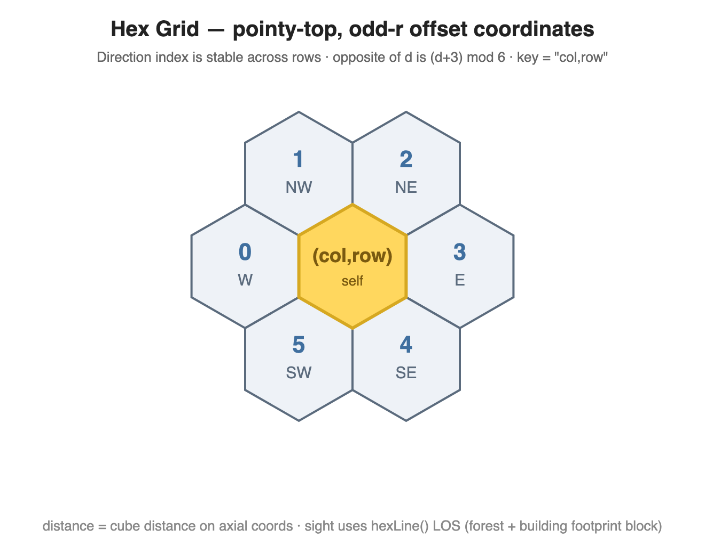
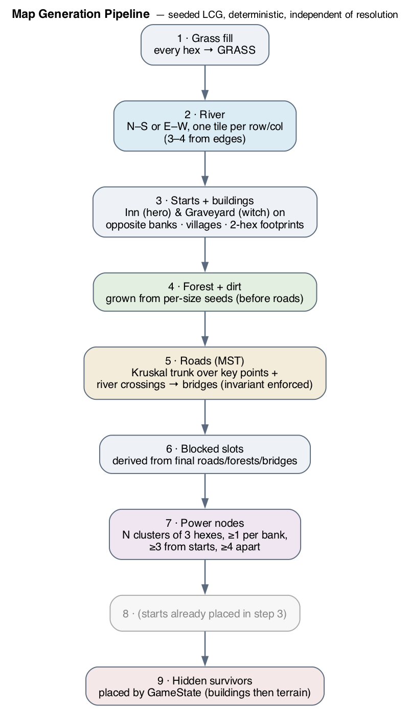
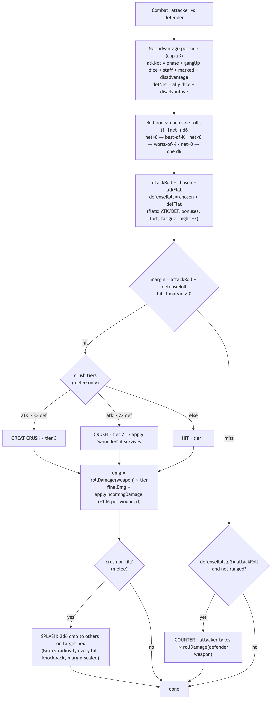
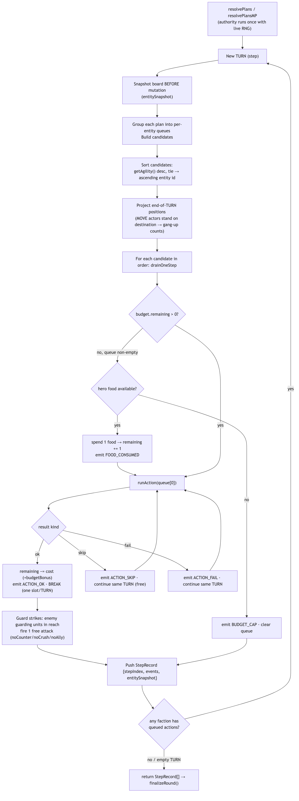
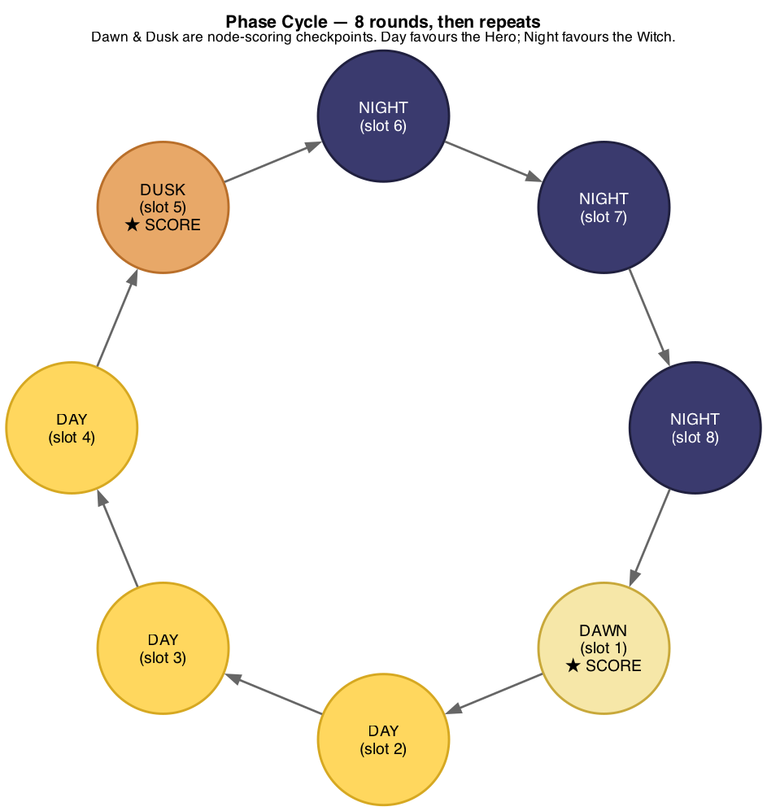
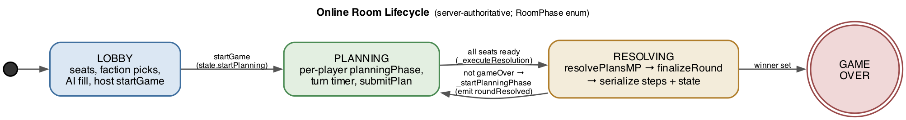
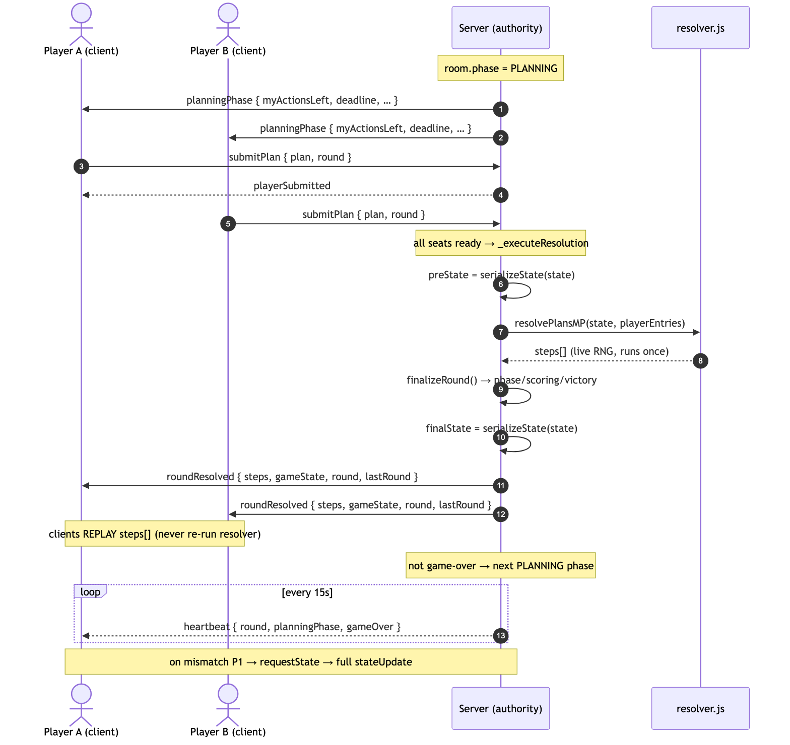

# Brimstone — Game Design Specification

> **Codename:** Brimstone · **Setting:** *Caleb's Hollow*, cursed colonial New England
> **Document purpose:** a complete, self-contained reference for the game's rules, data, turn
> structure, resolution algorithm, and server protocol — detailed enough to build a **second,
> behaviourally-identical server implementation** from this document alone.

This is one of three specifications:

1. **`01-game-design-spec.md`** (this file) — rules, units, combat, turn structure, resolution, server API.
2. **`02-ai-system-spec.md`** — the AI that plays both factions.
3. **`03-client-behavior-spec.md`** — the client: modes, UI, interactions, presentation.

Everything here is extracted from and verified against the reference implementation source. Where the
reference contains an internal design document that disagrees with the code, **the code is
authoritative** and the discrepancy is footnoted.

---

## 0. How to read this spec / what "identical" means

### 0.1 Two orchestrators, one rule engine

The game runs in two deployment shapes that share a single, DOM-free rule engine:

- **Offline** — a local client is the authority. It owns the canonical `GameState`, runs the
  resolver itself, and renders the result. Used for single-player vs-AI, hot-seat two-player,
  AI-vs-AI autoplay, and the campaign.
- **Online** — a Node/WebSocket server is the authority. Clients submit plans; the server resolves
  and broadcasts the result; clients replay it.

The resolver, the action rules, the combat math, the state shape and serialization are **the same
code in both**. "Build an identical server" therefore means: implement the same `GameState`, the
same `resolvePlans` algorithm, the same `serializeState` wire shape, and the same WebSocket/REST
protocol described in §11.

### 0.2 ⚠ Determinism: the authority is the source of truth, not a seed

A core thing a reimplementer must understand up front:

> **Round resolution is NOT a reproducible pure function of `(state, plans, seed)`.** Combat dice,
> random target selection when several enemies share a hex, and loot rolls all use an **unseeded**
> global RNG (`Math.random`). No seed is threaded into `resolvePlans`. (`state.mapSeed` seeds *map
> generation* only.)

The consequence is the central architectural rule of the whole system:

> **The authority resolves each round exactly once with live RNG, then ships (a) the ordered list of
> resolution events (`steps[]`) and (b) the resulting serialized `GameState`. Every other participant
> — the opponent's client, spectators, replay viewers — *replays the recorded events*; they never
> re-run the resolver.** Client-side mirror state is read-only; its mutators are no-ops.

So "byte-compatible" means: reproduce the `serializeState()` snapshot shape and the serialized step
event shape on the wire, and implement resolution logic that is *statistically equivalent*. It does
**not** mean two independent hosts will compute the same dice from the same inputs — only the
authority's emitted outcome is canonical. This is what the reference's "Sealed Resolution" invariant
actually guarantees: *replay reproduces, it never re-authors* — not cross-host bit-reproducibility.

A reimplementation that wants cross-host reproducibility (e.g. for verification) must thread a seeded
PRNG through `state.nextDie()` and every `Math.random` call site; the reference exposes the hook
(`state.nextDie(sides)`) but defaults it to `Math.random`.

### 0.3 Canonical vocabulary

| Term | Meaning | Code identifier |
|------|---------|-----------------|
| **ROUND** | Top-level unit. Every player submits one plan; all plans resolve; the phase advances. | `state.round`, `endRound()` |
| **TURN** | One lockstep slot inside a round's resolution. Contains actions from many units across all factions. The replay shows one card per TURN. | resolver "step" (`stepIndex`, `steps[]`) |
| **ACTION** | One unit's single act within a TURN (move, attack, summon…). | `PlanAction` / `ResEvent` |

> ⚠ The code predates this glossary: the resolver/UI call a TURN a **"step"**. This spec uses
> ROUND/TURN/ACTION but names the code identifiers so you can map them.

### 0.4 The damage/HP scale anchor

A single constant governs the HP economy: **`DAMAGE_SCALE = 7`**. Every `maxHp` value and every flat
HP delta (heals, damage-over-time, attrition, the `wounded` bonus) in the data tables is *already
multiplied by 7*. An unarmed attack rolls `2d6` (mean 7), so "hits to kill" is unchanged from a
pre-dice integer model — the scale exists only to give dice room. Keep this in mind reading every HP
number below: a 14-HP zombie dies to ~two average unarmed hits.

---

## 1. Game overview

Brimstone is a **turn-based, simultaneous-planning, hex-grid strategy game** for two asymmetric
factions fighting over a procedurally-generated map of Caleb's Hollow.

- **Hero faction** (the "day" side) — a leader (Paladin / Rogue / Captain) plus recruited
  **Survivors**. Strong in daylight. Can fortify, recruit, equip weapons & horses, explore.
- **Witch faction** (the "night" side) — a leader (Witch / Necromancer / Brute) plus **summoned**
  units (Minions, Wood/Iron Golems) and graveyard Zombies. Strong at night. Can summon and assault
  fortifications.

### 1.1 Win conditions

A game ends the instant any of these is true (checked at the end of every round, in priority order —
see §10.6):

1. **Custom victory delegate** — a campaign mission may install its own win/lose check (highest priority).
2. **Battle-mode timeout** — in the timed "Battle" game mode the game ends at a wall-clock deadline; the higher node score wins (tiebreak: more living leaders).
3. **Leader elimination** — every leader of one faction is dead ⇒ the other faction wins (`WITCH_SLAIN` / `HERO_SLAIN`). (The witch check is skipped in witch-less missions.)
4. **Node score threshold** — a faction reaches **4** node-score points ⇒ it wins (`SCORE_HERO` / `SCORE_WITCH`).

There is **no** "hold all nodes at once = instant win" rule (it was removed for being too easy to
stumble into). Node victory is purely the cumulative score race described in §10.5.

### 1.2 Game modes

`standard` (the default ruleset), `battle` (timed, large map, every-round scoring, no kill wins), and
the data-driven **campaign** (single-player JSON missions with custom victory delegates, waves, and a
mission-logic graph). Map sizes and player counts vary; see §2.5 and §10.

---

## 2. The hex grid & coordinate system

### 2.1 Storage coordinates — offset, odd-r, pointy-top

Tiles are stored in a `Map` keyed by **`hexKey(col,row) = "${col},${row}"`**, using **odd-r offset
coordinates** (pointy-top hexes; odd rows shoved half a hex right). `HEX_SIZE = 30` px (centre→vertex).

Two module globals hold the current map dimensions, set at map-gen time via
`setMapDimensions(cols, rows)`: `MAP_COLS`, `MAP_ROWS` (defaults 13×11, always overwritten).

### 2.2 Neighbours

Neighbour offsets depend on row parity:

```js
DIRS_EVEN = [[-1,0],[-1,-1],[0,-1],[1,0],[0,1],[-1,1]];   // row % 2 === 0
DIRS_ODD  = [[-1,0],[0,-1],[1,-1],[1,0],[1,1],[0,1]];     // row % 2 === 1
```

The **direction index is stable across rows**: `0 = W, 1 = NW, 2 = NE, 3 = E, 4 = SE, 5 = SW`. The
opposite edge of direction `d` is `(d+3) % 6`. `getNeighbors(col,row)` returns the six neighbours,
dropping any with a negative coordinate (upper-bound clipping is done by callers against
`MAP_COLS/MAP_ROWS`).



### 2.3 Axial conversion & distance

```js
offsetToAxial(col,row) = { q: col - (row - (row & 1)) / 2, r: row }
axialToOffset(q,r)     = { col: q + (r - (r & 1)) / 2,    row: r }

hexDistance(a,b) = (|aq-bq| + |aq+ar-bq-br| + |ar-br|) / 2     // cube distance on axial coords
```

`hexLine(c1,r1,c2,r2)` — cube linear interpolation + cube rounding, inclusive endpoints; used for
line-of-sight. `hexRange(col,row,radius)` — every hex within `radius`, clipped to the map
(LOS deliberately bypasses this clip). `hexToPixel`/`pixelToHex` map between storage coords and screen
space for the renderer.

### 2.4 Tile capacity & sub-hex slots

Each tile holds up to **`TILE_CAPACITY = 7`** sub-hex *slots*: slot `0 = centre`, slots `1..6` =
outer ring. One unit per slot. `pickUnitSlot` chooses the lowest free non-blocked slot, centre
preferred. Slots can be *blocked* by terrain:

- **Forest** tiles spawn trees on outer slots (seeded `[3,5] × FOREST_DENSITY_SCALE(0.6)`, ≥1), each occupying one slot.
- **Bridge** tiles block *all* non-road outer slots.
- **Building footprint** hexes have capacity 0 (no units stand on them).

### 2.5 Map sizes

| Size | cols×rows | villages | min village dist | node count (resolved/min/max) | survivors {bldg,terrain} | bridge max | min bridges |
|------|-----------|----------|------------------|-------------------------------|--------------------------|-----------|-------------|
| `skirmish` | 10×10 | market, parish | 6 | 1 (1/3) | {4,1} | 1 | 1 |
| `standard` | 14×14 | market, parish, harbor | 6 | 3 (2/5) | {7,1} | 2 | 1 |
| `regional` | 19×19 | + garrison | 7 | 3 (2/6) | {10,2} | 2 | 1 |
| `campaign` | 23×23 | + farmstead | 8 | 3 (2/7) | {13,3} | 3 | 1 |
| `battle` | 42×42 | 10 villages | 8 | 5 (3/7) | {28,8} | 10 | 5 |

---

## 3. Map generation

Map generation is **seeded and deterministic** (a linear-congruential `rng(seed)`), independent of
resolution. `generateMap(seed, mapSize, nodeCountOverride)` runs this pipeline:



1. **Grass fill** — every hex becomes a `GRASS` tile.
2. **River** — 50/50 a North–South or East–West river; exactly one river tile per row (NS) or column (EW), kept 3–4 tiles from the edges; sets `path = RIVER`.
3. **Faction starts + buildings** — hero start = an **Inn**, witch start = a **Graveyard**, placed on *opposite river banks*, hex-distance > `START_SIGHT_CLEARANCE (6)`, not river-adjacent (tiered fallback → opposite corners). Then villages: archetype clusters (`VILLAGE_TEMPLATES`) placed ≥`MIN_SEP` apart, ≥1 per bank (radius 4). Buildings materialise in two passes: pass 1 lays the passable **entrance**; pass 2 claims one impassable **footprint** neighbour, rolling the building back entirely if none is eligible.
4. **Forest + dirt** (before roads) — forest grows from per-size `forestSeeds` (70% seed, 40% spread); 10 dirt-patch seeds spread on grass.
5. **Roads** — two-tier network: tier-1 intra-village spokes, tier-2 inter-village trunk = a **Kruskal MST** over key points (Inn, Graveyard, village roots) plus pre-selected river-crossing banks. River crossings become **bridges** (between `minBridges` and `bridgeMax`). A **bridge invariant** is enforced and asserted: every bridge has exactly two reciprocal road links on opposite edges.
6. **Blocked slots** derived from final roads/forests/bridges.
7. **Power nodes** — `_pickNodesAcrossRiver`: `resolvedNodeCount` nodes (clamped to the size's min/max), ≥4 apart, ≥1 per bank, ≥3 hexes from starts, off buildings; each node is a **3-hex triangle cluster**.
8. (Starts already placed in step 3.)
9. **Hidden survivors** — placed later by `GameState._placeHiddenSurvivors`: `survivorCounts {buildings, terrain}` per size, ≥3 hexes from starts, buildings preferred then terrain.

Returns `{tiles, witchObjectives, heroStart, witchStart, mapSize, seed, season, survivorCounts, …}`,
`season ∈ {summer, fall, spring, winter}` (cosmetic).

---

## 4. Tiles & terrain

### 4.1 Layered tile model

A tile is the composition of three layers (plus a derived legacy type for old readers):

- `base ∈ {grass, forest, dirt}`
- `structure ∈ {null, building}`
- `path ∈ {null, road, river, bridge}`

`legacyTileType` precedence for rendering/serialisation: `path > building > base`. `TileType` enum:
`grass, forest, dirt, road, river, bridge, building`.

### 4.2 Passability & movement cost

- **Passable:** everything except **river** (and fort walls — see §4.4). Bridges are passable.
- **Movement cost** per entered tile: **road / bridge / building = 1**, everything else passable = **2**.

So a move with range 1 (the default) covers one off-road tile *or* two road tiles; range 2 (mounted)
covers two off-road *or* four road tiles. (See §9 MOVE.)

### 4.3 Buildings

13 building types: `town_hall, church, inn, blacksmith, graveyard, mill, dock, house, barn,
watchtower, apothecary, storehouse, stable`. Each occupies **two hexes**: a passable **entrance**
(carries the `building` tag, loot table, fortify state, and any hidden survivor; movement cost 2 as a
non-road tile — but treated as road-like cost 1 by the passability helper) and an impassable
**footprint** (capacity 0, blocks line of sight, holds the 3-D model). The entrance references its
footprint via `footprintHexes[]`; the footprint references the entrance via `buildingFootprintOf`.

### 4.4 Fortification

Tiles carry a fortification level/HP (heroes build it; see §9 FORTIFY):

- `FORTIFY_HP_PER_LEVEL = 20`, `MAX_FORTIFY_LEVEL = 6`, `MAX_FORTIFY_HP = 120`.
- `fortifyLevel = clamp(ceil(HP / 20), 0, 6)` — **HP is the source of truth**, level is derived.
- `FORT_IMPASSABLE_THRESHOLD = 2`: at level ≥ 2 the tile becomes a **wall** that blocks any faction
  flagged `isBlockedByWalls()` (the witch side). Level 1 is passable.
- The fort combat bonus table (indexed by level 0…6) — **applies to the hero side only**:

  | Level | 0 | 1 | 2 | 3 | 4 | 5 | 6 |
  |-------|---|---|---|---|---|---|---|
  | +ATK (attacker on fort) | 0 | 0 | 0 | 1 | 2 | 3 | 4 |
  | +DEF (defender on fort) | 0 | 1 | 2 | 2 | 3 | 4 | 5 |

### 4.5 Line of sight

`blocksLineOfSight` is true for a **building footprint** *or* **forest cover** (base material =
forest, regardless of overlay). Building entrances are transparent. Endpoints are exempt. Forest
cover also grants **+1 DEF vs ranged** attacks (§8).

### 4.6 Resources (shared & personal pools)

Six resource types, held in **shared faction pools** (`state.inventory.hero` / `.witch`, dict
`{id:{count}}`) except herbs which are personal-ish (consumed from the shared pool by heal):

| Resource | Effect | Scope |
|----------|--------|-------|
| `herbs` | Heal `2d10` HP (HEAL action) | shared pool |
| `silver` | +1 ATK on next battle this turn | shared |
| `wood` | Fortify +1 level / summon a Wood Golem | shared |
| `metal` | Fortify +2 levels / summon an Iron Golem | shared |
| `food` | +1 action point (hero); funds over-budget actions during resolution | shared |
| `scripture` | Ward (log-only flavour) | shared |

Mutate via `addItemInItems` / `removeItemInItems` / `getItemCountOf` / `totalItemCount`.

---

## 5. Entities & units

### 5.1 Entity types & base stats

`EntityType` (wire/save values): `paladin` (the Hero leader; aliased from legacy `hero`), `rogue`,
`captain`, `witch`, `necromancer`, `brute`, `survivor`, `soldier`, `zombie`, `minion`, `wood_golem`,
`iron_golem`.

Base stats (`UNIT_TYPES`) — **`maxHp` is already ×7**:

| Type | maxHp | ATK | DEF | agility | tags |
|------|-------|-----|-----|---------|------|
| `paladin` | 98 | 2 | 2 | 6 | living, leader, day-leader |
| `rogue` | 70 | 3 | 1 | 8 | living, leader, day-leader |
| `captain` | 84 | 2 | 3 | 5 | living, leader, day-leader |
| `witch` | 70 | 2 | 2 | 5 | living, leader, night-leader |
| `necromancer` | 70 | 1 | 2 | 4 | living, leader, night-leader |
| `brute` | 100 | 4 | 3 | 3 | living, leader, night-leader |
| `survivor` | 28 | 1 | 1 | 4 | living |
| `soldier` | 14 | 1 | 1 | 5 | living, soldier, summoned |
| `zombie` | 14 | 2 | 0 | 2 | undead |
| `minion` | 14 | 1 | 0 | 5 | minion, summoned |
| `wood_golem` | 21 | 2 | 3 | 3 | construct, summoned |
| `iron_golem` | 35 | 3 | 2 | 2 | construct, summoned |

Leaders also receive a **starting weapon** that raises their effective ATK (e.g. Paladin 2 + sword 2
= **4**; Witch 2 + magic-bolt 1 = **3**). Agility drives resolution order (§10.3) and the sight model.

### 5.2 Entity fields

Each entity carries: `id` (`"e<n>"`), `type`, `owner` (`'hero' | 'witch' | null` — the **side**),
`ownerId` (player UUID, for N-player games), `factionId` (concrete faction on leaders, e.g. `rogue`),
`col`, `row`, `slot`, `maxHp`, `hp`, base `attack`/`defense`/`agility`, `tags[]`,
`attackBonus`/`defenseBonus` (per-turn, reset each round), `name`/`title`/`bio`, `abilities[]`,
`actedThisTurn`, `defendCount`, `guarding` (guard charges), `equippedThisRound`, `killsThisRound`,
`effects[]`, `level` (≥1), `xp`, and **`items`** = `{ id: { count, equipped? } }`.

> There is **no `weapon` slot and no innate `range` field**. The equipped weapon lives inside `items`
> tagged `equipped`; range is *entirely* weapon-derived and composed on demand (default 1 = melee).

### 5.3 Derived stat accessors (composed at call time)

```
getAttack()    = attack + atkBonusForLevel(level) + equippedWeapon.statMods.attack + abilityStatMod + effectStatMod
getDefense()   = defense + defBonusForLevel(level) + equippedWeapon.statMods.defense + abilityStatMod + effectStatMod
getAgility()   = agility + abilityStatMod + effectStatMod
getRange()     = (equippedWeapon.range ?? 1) + abilityRangeMod + effectRangeMod        // default 1
getMoveRange() = 1 + (hasItem('horse') ? 1 : 0)                                         // 1 or 2
```

`attackBonus`/`defenseBonus` are *flat per-turn* bonuses (silver, inspire, fortification) applied
on top inside combat.

### 5.4 Level & XP scaling

```
LEVEL_HP_PER = 0.25
hpForLevel(base, L)  = round(base * (1 + 0.25*(L-1)))   // L1 ×1.00, L2 ×1.25, L3 ×1.50 …
atkBonusForLevel(L)  = L - 1
defBonusForLevel(L)  = floor((L-1) / 2)
```

XP is **campaign-only** and only for hero-owned units. Awards: explore 5, fortify 10 (+5 per existing
level), hit 15, crush 25, kill 50, defend 5, counter 15; gang-up allies get a 25% floored share.
`xpForLevel(L) = (L-1)*(200 + 100*(L-2))` for L≥2 → cumulative thresholds 0, 200, 600, 1200, 2000, …;
level caps at 99.

### 5.5 Factories

`createHero/Rogue/Captain/Witch/Necromancer/Brute/Survivor/Zombie/Minion/WoodGolem/IronGolem/Soldier`.
Leaders are built through `Faction.createLeader`, which stamps innate abilities and the starting
weapon. Survivors are built from a 20-character roster (§6.4).

---

## 6. Items, weapons, abilities & effects

### 6.1 Weapons

Weapons live in the `ITEMS` table. `statMods` (ATK/DEF) are **flat**; `damage` is **rolled per hit**;
`range > 1` makes a weapon ranged.

| id | category | ΔATK | ΔDEF | damage | range | special |
|----|----------|------|------|--------|-------|---------|
| `sword` | melee | +2 | 0 | 2d6 | 1 | hero starting weapon |
| `axe` | melee | +1 | +1 | 1d12+1 | 1 | |
| `dagger` | melee | +1 | 0 | 1d10 | 1 | |
| `staff` | melee | +1 | 0 | 2d6 | 1 | +1 advantage die vs `undead` |
| `shield` | melee | 0 | +2 | 2d6 | 1 | |
| `bow` | ranged | 0 | 0 | 2d4 | 3 | rogue starting weapon |
| `crossbow` | ranged | +1 | 0 | 1d10 | 2 | |
| `musket` | ranged | +2 | 0 | 2d8 | 2 | |
| `pistol` | ranged | +1 | 0 | 1d10 | 2 | |
| `sling` | ranged | 0 | 0 | 2d4 | 2 | |
| `magic_bolt` | ranged | +1 | 0 | 2d6 | 2 | witch/necro only, never loots |
| `greatsword` | melee | +3 | 0 | 3d6 | 1 | **premium**, drops only round ≥ 8 |
| `longrifle` | ranged | +3 | 0 | 2d8+2 | 3 | **premium**, round ≥ 9 |
| `warhammer` | melee | +2 | +1 | 1d12+4 | 1 | **premium**, round ≥ 10 |
| `horn` | key | — | — | — | — | enables Sound Horn; never loots |

`rollDamage({count,sides,flat})` sums `count` dice of `sides`, adds `flat`, `max(1, total)`. Unarmed
fallback = `2d6` (`DEFAULT_ATTACK_DAMAGE`).

### 6.2 Abilities

| id | kind | effect |
|----|------|--------|
| `fortify_double` | passive | wood fortifies +2 levels instead of +1 |
| `heal` | active (1 AP) | heal co-located leader +7 HP (`1 × DAMAGE_SCALE`) |
| `brawler` | passive | +1 ATK |
| `sturdy` | passive | +1 DEF |
| `herbalist` | passive | +1 herbs on each explore |
| `inspire` | active (0 AP) | co-located leader +1 attackBonus this turn |
| `rally` | active (0 AP) | leader +1 action point this round (`budgetBonus`) |
| `scout` | passive | +1 sight range |
| `berserker` | passive | becomes `frenzied` after the 2nd kill in a round |
| `eagle_eye` | passive | +1 range |
| `sound_horn` | innate active | day-side leaders only — recruit/reveal (§9) |
| `summon` | innate active | night-side leaders only — summon units (§9) |

### 6.3 Status effects

Registry — each effect carries a default duration (rounds) and modifiers; durations decrement at
round end (`'mission'`/`'permanent'` never expire); re-applying refreshes to max duration:

| Effect | Default duration | Effect |
|--------|------------------|--------|
| `wounded` | 1 | +1d6 damage taken from any source (per stack) |
| `poisoned` | 3 | −1 DEF + damage-over-time |
| `bleeding` | 2 | damage-over-time |
| `stunned` | 1 | cannot act |
| `slowed` | 1 | −1 agility (shifts resolution order) |
| `marked` | 2 | attackers get +1 advantage die vs this unit |
| `cursed` | mission | cannot heal |
| `frenzied` | 1 | +1 ATK / −1 DEF |
| `inspired` | 1 | +1 ATK |
| `fortified` | 2 | +1 DEF |
| `eagle_eyed` | mission | +1 range |

A DOT tick deals `stacks × DAMAGE_SCALE(7)` per round. A trigger DSL (`dispatchTrigger`) fires effect
changes on events — e.g. `berserker` applies `frenzied` when `killsThisRound >= 2`.

### 6.4 Survivor roster

20 named survivors with authored stats and one passive each (e.g. *John O'Connor* 35/2/2 + `fortify_double`;
*Mary Quinn* 35/1/3 + `heal`; *Hannah Marsh* 49/1/2 + `sturdy`). These roster `maxHp` values are used
*directly* (they are already on the ×7 scale: 28=4×7, 35=5×7, 49=7×7). Each survivor has a distinct
display colour.

---

## 7. Factions

Both factions share a budget/sight framework but differ sharply. `getFaction(side)` returns the
faction behaviour object.

### 7.1 Hero faction (day side)

- `actionCap = 8`, `unitBonusCap = 5`, favourable phases **DAWN & DAY** (+1 action).
- Abilities: `canFortify`, `canUseItems`, `canEquipHorse`, `canEquipWeapon`, `canDiscoverNPCs`.
- Defender **fatigue**: −`floor(defendCount/2)` DEF (stacks as a unit defends repeatedly).
- **Sight** (line-of-sight based): DAY 6 / DAWN & DUSK 4 / NIGHT 3 (+1 with `scout`).
- Starting resources `{food: 2}`. Innate ability `sound_horn`; innate weapon `sword`.

### 7.2 Witch faction (night side)

- `actionCap = 8`, `unitBonusCap = 4`, favourable phase **NIGHT** (+1 action).
- Abilities: `canSummon`, `canAssaultFortifications`, `isBlockedByWalls` (level-2+ forts block it).
- **Phase combat bonus: +2 flat ATK at NIGHT** (applied as a flat attacker bonus, not advantage dice).
- **Sight: a fixed radius of 5** in all phases (radial distance, not true LOS).
- Only the night-side leader can explore. Starting resources `{wood: 2, metal: 2}`. Innate ability
  `summon`; innate weapon `magic_bolt`; **may only equip `magic_bolt`**.

### 7.3 Alternate leaders

- **Rogue** (hero variant) — starts with a **bow** (range 3), equips ranged weapons only, **+1 sight every phase** (DAY 7 / DAWN-DUSK 5 / NIGHT 4), re-rolls "nothing" loot, has an agility-driven bonus resource roll, auto-detects survivors in adjacent buildings on move.
- **Captain** (hero variant) — inherits Hero; **no** starting weapon.
- **Necromancer** (witch variant) — inherits Witch.
- **Brute** (witch variant) — **melee, no Magic Bolt**; melee hits splash (radius 1) on *every* hit, with knockback, margin-scaled tiers, sparing allies; summons **minions only** at minion cost 1; auto-zombifies survivors in adjacent buildings.

Difficulty handicaps adjust starting resources (none / low / medium / high).

---

## 8. Combat

Combat is the most important sub-system to get exactly right. It is a **dice-pool advantage system**.



### 8.1 Net advantage per side (capped at ±3)

```
ADVANTAGE_CAP = 3

atkNet = clamp(  (phaseAdvantage + atkAdvantageDice + atkStaffAdvantage + defMarkedAdvantage)
               - atkDisadvantageDice ,  -3, +3 )
defNet = clamp(  defAdvantageDice - defDisadvantageDice ,  -3, +3 )
```

`phaseAdvantage` defaults to 0 — **the day/night phase bonus is applied as a flat ATK bonus, not as
advantage dice** (see §8.4).

### 8.2 The roll

```
pool(net) = roll (1 + |net|) d6
chosen(net) = net > 0 ? max(pool)        // advantage: best-of-K
            : net < 0 ? min(pool)        // disadvantage: worst-of-K
            : pool[0]                    // even: a single d6

attackRoll  = chosen(atkNet) + atkFlat
defenseRoll = chosen(defNet) + defFlat
margin      = attackRoll − defenseRoll
hit         = margin > 0

atkFlat = attackOf(attacker)  + attacker.attackBonus  + extraAtkBonus       // §8.4 modifiers
defFlat = defenseOf(defender) + defender.defenseBonus + extraDefBonus − fatiguePenalty
```

Dice come from `state.nextDie(6)` (the seedable hook; defaults to `Math.random`).

### 8.3 Outcome tiers, damage & counter

```
isCrush      = hit && !ranged && attackRoll >= 2 * defenseRoll
isGreatCrush = hit && !ranged && attackRoll >= 3 * defenseRoll
tier         = isGreatCrush ? 3 : isCrush ? 2 : 1

dmgRoll  = rollDamage(attackerWeapon)            // e.g. sword 2d6; unarmed 2d6
baseDmg  = dmgRoll * tier
finalDmg = target.applyIncomingDamage(baseDmg)   // adds +1d6 per `wounded` stack
```

`applyIncomingDamage(base) = max(1, base + effectFlat + Σ wounded(1d6 each))`.

**Counter** — when the attack *misses* and the defence roll is overwhelming:

```
if (!hit && !ranged && !noCounter && defender.alive && defenseRoll >= 2 * attackRoll)
    attacker takes applyIncomingDamage( rollDamage(defenderWeapon) )   // one 1× roll, no tiering
```

A non-fatal **crush** (tier ≥ 2) applies `wounded` (1 round, +1d6 incoming) to the survivor.

### 8.4 Combat modifiers

Assembled in `computeBattleContext` before the roll:

| Modifier | Value | Notes |
|----------|-------|-------|
| Phase (witch, NIGHT) | **+2 flat ATK** | applied via `extraAtkBonus` |
| Gang-up (melee only) | per ally adjacent to the **target hex**: **+1 advantage die AND +1 flat ATK**, each capped at `min(allies, 3)` | not available to ranged attacks |
| Staff vs undead | +1 attacker advantage die (defender has `undead` tag) | weapon `combatTriggers` |
| `marked` effect | +1 attacker advantage die vs that defender | |
| Fortification (**hero side only**) | attacker on fort: +ATK; defender on fort: +DEF (table §4.4) | witch side gets 0 |
| Forest cover (ranged only) | defender +1 DEF if defender's tile base = forest | |
| Fatigue (defender) | hero: −`floor(defendCount/2)` DEF; witch: 0 | |
| Range falloff (ranged) | −`floor((dist−1)/2)` ATK → 0 @ 1–2, −1 @ 3–4, −2 @ 5–6 | |
| Close-range (ranged at dist ≤ 1) | attacker rolls **1 disadvantage die** | "point-blank" penalty |
| Silver consumed | +1 attackBonus this turn (flat) | from USE_ITEM |

### 8.5 Ranged rule set

When `getRange() > 1` the attack is ranged and: **no gang-up** (either side), **never crushes**
(always tier 1), **no splash**, **no counter**, defender gets **+1 DEF in forest**, suffers
**point-blank disadvantage** at distance ≤ 1, and **distance falloff**. Phase, fortification, and
weapon triggers still apply. Targets any enemy within `getRange()` (LOS permitting).

### 8.6 Splash (melee)

- **Vanilla:** splashes only on a **crush or a kill**. Splash damage = a flat **2d6 chip** (does *not*
  scale with margin) to other units on the *target hex* (excluding attacker and target). No chaining.
- **Brute override:** `crushSplashRadius = 1` (target hex + 6 neighbours), splashes on *every* hit,
  spares allies, applies knockback (push 1 hex outward), and scales with margin
  (`tier = clamp(floor(margin/3), 1, 3)`, rolling that many d6).
- A **counter-kill** also splashes (the defender's faction config, tier 1).

### 8.7 Fortification erosion

Every swing against a unit on a fort erodes the fort HP: on a hit/crush the fort takes the HP that was
dealt to the defender; on a miss it takes `chip = round(FORT_MISS_CHIP_MAX × 1/(1+gap))` where
`gap = defenseRoll − attackRoll` and `FORT_MISS_CHIP_MAX = 5`.

### 8.8 Fort assault (witch only)

`executeFortAssault` lets a witch-side unit adjacent to an **impassable wall** (level ≥ 2) siege it.
The fort defends with a flat `fortLevel + 1`; a hit drains `floor(20/2) = 10` HP, a crush (atk ≥ 2×def)
drains 20 HP; no counter. Witch gang-up advantage applies.

### 8.9 Exact odds (for previews)

`Entity.computeCombatOdds` enumerates the full distribution analytically (best/worst-of-K via
`_chosenDieProb`) and returns `{hit, crush, counter, miss}` without sampling — used by the client's
pre-attack odds preview, never by resolution.

---

## 9. Actions

`ActionType`: `move, explore, battle, battle_hex, fortify, summon, heal, use_item, equip_weapon,
use_ability, guard, sound_horn, sent_to`. Every executor has the signature
`execute*(state, actor, …) → { success, log, cost }`; the caller deducts `cost` action points.

### 9.1 Action-point costs

| Action | AP cost | Notes |
|--------|---------|-------|
| MOVE | 1 | walks up to `maxSteps` tile steps |
| EXPLORE | 1 | |
| BATTLE / BATTLE_HEX | 1 | |
| FORTIFY | 1 | hero only |
| SUMMON | 1 | witch only; *also* spends resources |
| HEAL | 1 | spends 1 herb |
| GUARD | 1 | stacks a reactive charge |
| SOUND_HORN | 1 | also consumes 1 food |
| USE_ITEM | **0** | food / silver / scripture / weapon-equip |
| EQUIP_WEAPON | **0** | once per round per unit |
| USE_ABILITY | 0 or 1 | per ability (heal = 1; inspire/rally = 0) |
| SENT_TO | **0** | multiplayer survivor transfer |

`actionCosts(type)` = 1 for everything except `use_item`, `equip_weapon`, `sent_to`.

### 9.2 MOVE

Move range = `getMoveRange()` (1, or 2 mounted); `maxSteps = hasHorse ? 4 : 2`; per-tile cost
road/bridge/building 1, else 2. Path-finds via a road-preferring Dijkstra (`findShortestPath`), walks
step-by-step, and stops at an enemy / fort wall / full hex / river. Moving **breaks guard**
(`guarding = 0`). Each move step has a chance to reveal a nearby hidden survivor (§9.10).

### 9.3 EXPLORE

One-time per tile (`tile.explored`); footprint hexes are not explorable. Rolls loot from the building
loot table (if on a building entrance) or the terrain loot table (road-over-forest rolls the forest
table). Mission overrides and the premium tier-gate are applied. In N-player games extra rolls scale
with side size. The `herbalist` ability adds +1 herbs; the rogue's agility grants a bonus resource
roll. **At DAWN every tile's `explored` flag is reset**, so tiles re-loot each cycle.

### 9.4 BATTLE / BATTLE_HEX

- **BATTLE_UNIT** targets a specific entity by id; skipped (with `targetFled`) if it died or moved out
  of range. Melee targets must be adjacent or share the hex; ranged within `getRange()`.
- **BATTLE_HEX** is a blind attack on a hex (used through fog): it hits a random enemy standing there,
  whiff-skips if empty, ignores LOS but respects range. If the hex is an impassable wall and the actor
  can assault fortifications and is adjacent, it becomes a **fort assault** (§8.8).

### 9.5 FORTIFY (hero only)

Spends shared inventory — **metal preferred** (+2 levels = +40 HP), else **wood** (+1 level = +20 HP,
or +2 with a `fortify_double` survivor). Caps at `MAX_FORTIFY_HP = 120`.

### 9.6 SUMMON (witch only)

Costs resources from the shared witch pool (in addition to the 1 AP):

- **Iron Golem**: 2 metal. **Wood Golem**: 2 wood. **Minion**: `minionCost` of *any* resources
  (witch 2, brute 1), spent largest-stack-first.
- Auto-pick priority iron > wood > minion (the Brute is minion-only). Spawns on the summoner's tile;
  increments `witchSummonCount`. A `state.maxWitchSummons` cap exists for the tutorial only.

### 9.7 HEAL / USE_ITEM / EQUIP_WEAPON / USE_ABILITY

- **HEAL** — needs 1 herb, target below max HP; heals **2d10**.
- **USE_ITEM** (0 AP) — equip a weapon (once/round, faction-gated); FOOD (hero) returns
  `budgetBonus: 1`; SILVER grants +1 attackBonus; SCRIPTURE is a ward log.
- **EQUIP_WEAPON** (0 AP) — flips the `equipped` tag, capped once/round per unit.
- **USE_ABILITY** — dispatches to `ABILITIES[id].execute` (§6.2).

### 9.8 GUARD

Cost 1; `guarding += 1` (stacking charges). During resolution, after any enemy's successful action,
each guarding unit within reach of the trigger hex fires one free reactive attack (§10.4). Charges are
spent one per strike; moving clears all charges.

### 9.9 SOUND_HORN (hero) & SENT_TO (multiplayer)

- **SOUND_HORN** — needs the `horn` key item + 1 food (consumed); reveals the hero to opponents this
  round; finds hidden survivors within 4 hexes (first guaranteed, second at 30%).
- **SENT_TO** (0 AP, MP only) — transfers a survivor to another live leader on the same faction.

### 9.10 Survivor discovery

Moving has a phase-dependent chance to find a hidden survivor: **DAY 0.50 / DAWN & DUSK 0.35 / NIGHT
0.25**, times `survivorFindMultiplier = max(0, 1 − 0.10 × activeSurvivors)` (→ 0 once you have ≥ 10).
Explore always finds (chance 1.0 × the same multiplier). Hidden survivors are pre-placed ≥ 3 hexes
from the starts.

---

## 10. The round: planning, resolution, scoring, victory

A round is: **plan → submit → resolve → finalize**. Both factions plan simultaneously and privately;
when all are ready, the authority resolves all plans together in lockstep TURNs, then advances the
phase, scores, and checks victory.

### 10.1 Plans & the action budget

A plan is a flat **`PlanAction[]`** (max length `MAX_PLAN_LENGTH = 12`). Each action has `entityId`
and a `type` (a `PlanActionType`), plus type-specific fields:

| `PlanActionType` | value | extra fields |
|------------------|-------|--------------|
| `MOVE` | `move` | `toCol`, `toRow` |
| `BATTLE_UNIT` | `battle-unit` | `targetId` (+ optional `targetCol`,`targetRow` fallback) |
| `BATTLE_HEX` | `battle-hex` | `targetCol`, `targetRow` |
| `EXPLORE` | `explore` | — |
| `FORTIFY` | `fortify` | — |
| `SUMMON` | `summon` | optional `summonType` |
| `HEAL` | `heal` | — |
| `USE_ITEM` | `use-item` | `item` |
| `EQUIP_WEAPON` | `equip-weapon` | `weapon` |
| `USE_ABILITY` | `use-ability` | `ability` |
| `GUARD` | `guard` | — |
| `SOUND_HORN` | `sound-horn` | — |
| `SENT_TO` | `sent-to` | `destOwnerId` |

The **action budget** per player per round:

```
total = base(3) + favorablePhaseBonus(+1) + min(unitCount, unitBonusCap) + nodeBonus,  capped at actionCap
```

where `unitCount` = alive non-leader units of that faction (per-`ownerId` in MP), `nodeBonus` = +1
per held power node. When the sum exceeds the cap, it is trimmed node→unit→phase→base. Per the
faction tables (§7): Hero `unitBonusCap 5 / actionCap 8`, favourable DAWN & DAY; Witch `unitBonusCap
4 / actionCap 8`, favourable NIGHT. During resolution, **food can fund one over-budget action** (§10.4).

**Validation has two tiers:**

- `validatePlanAction` (client, advisory) — rejects missing/dead/stunned actors, illegal moves, etc.
- `validatePlan(state, playerId, plan)` (authority, structural) — array, `length ≤ 12`, each item an
  object with a string `entityId` and a valid `type`; if `playerId` is given, the entity must exist,
  be alive, and be owned by that player. It does **not** check per-action legality (range/target) —
  that is deferred to the resolver, which is authoritative.

### 10.2 The resolution algorithm

There are two resolver entry points sharing one engine:

- `resolvePlans(state, heroPlan, witchPlan)` — legacy 2-player; returns step records with
  `{ heroEvents, witchEvents }`.
- `resolvePlansMP(state, playerEntries)` — N-player; `playerEntries = [{playerId, faction, plan}]`;
  returns step records with `{ playerEvents: [{playerId, faction, events}] }`.

Both produce a **`StepRecord[]`** — one record per TURN:

```
StepRecord = {
  stepIndex,
  heroEvents | witchEvents | playerEvents,   // SubEvent buckets
  entitySnapshot: EntitySnap[],              // board state BEFORE this TURN mutated it
  logicEvents?                               // optional mission-logic "Show" events
}
```



Per TURN:

1. **Snapshot** the board (`entitySnapshot`) *before* mutation.
2. **Group** each faction's flat plan into per-entity action queues.
3. **Build candidates** (one per entity with a non-empty queue) and **sort by `getAgility()`
   descending, ties broken by ascending numeric entity id** (so `slowed` shifts order).
4. **Project end-of-TURN positions** (`computeTurnEndPositions`): an actor whose next action is a MOVE
   is treated as already standing on its destination, so gang-up/flank counts use **end-of-TURN**
   positions (moves are simultaneous with battles within a TURN).
5. **Drain** each candidate via `drainOneStep` in sorted order, tagging every emitted event with a
   monotonic `resOrder` (the true cross-faction resolution order), bucketing events by faction/player.
6. Fan **SENT_TO** transfers into the recipient's event bucket.
7. Capture optional mission-logic Show events.
8. Push the `StepRecord`; `stepIndex++`.

The loop ends when no faction has queued actions, or a TURN produced zero events.

### 10.3 `drainOneStep` — one action point per actor per TURN

This is the heart of resolution. A single TURN consumes **at most one budget point** per actor queue:

1. If `budget.remaining <= 0` but the queue is non-empty: try to spend **1 food** from the hero pool →
   `remaining += 1`, emit `FOOD_CONSUMED`. Otherwise emit `BUDGET_CAP`, clear the queue, return.
2. While `queue.length && budget.remaining > 0`, run `runAction(queue[0])`:
   - **`ok`** → `remaining -= cost; remaining += budgetBonus`, shift the action, log it, emit
     `ACTION_OK { faction, action, result, battleSnaps }`, award XP (campaign), and **break** (this
     TURN's slot is spent).
   - **`skip`** → shift the action, emit `ACTION_SKIP { action, reason, targetFled, … }`, **continue**
     (try the next action this same TURN — skips are free).
   - **`fail`** → shift the action, emit `ACTION_FAIL { action, reason, blockedBy, blockedByFort }`,
     **continue**.
3. After a successful action, run guard strikes (§10.4).

So one `StepRecord` may contain many sub-events for a single actor (a run of free skips/fails before
the one `ok`), plus guard reactions, plus every other actor's events for that TURN.

### 10.4 Guard strikes

After any successful action, every **enemy** unit with `guarding > 0` that can reach the *trigger hex*
(the MOVE destination, else the actor's hex) fires one free reactive `executeBattle(..., {noCounter,
noCrush, noAlly})`, emitted as a normal `ACTION_OK` flagged `guardReaction: true`. Melee reach =
adjacent; ranged reach = `min(getRange, sight)` with clear LOS (never into fog). Each strike spends
one guard charge.

### 10.5 Phase cycle & scoring

The phase advances one step per round in an 8-round cycle (`CYCLE_LENGTH = 8`):



```
phaseForRound(round):  r = (round-1) % 8
  r == 0      → DAWN   (1 round, scores)
  r ∈ [1,3]   → DAY    (3 rounds)
  r == 4      → DUSK   (1 round, scores)
  r ∈ [5,7]   → NIGHT  (3 rounds)
```

(Campaign missions may override the cycle via `cycleConfig {phases[], loop}`.)

**Node control:** for each power-node cluster, the faction occupying the most of its hexes controls it
(multiple units on one hex count once); ties = `contested`, empty = `neutral`.

**Scoring** runs only at **DAWN and DUSK**: count nodes the hero controls vs the witch (contested /
neutral excluded); whichever leads gets **+1 node-score point** (a tie scores nobody). `nodeScore`
starts at `{hero: 0, witch: 0}`. **First faction to `nodeScoreThreshold = 4` points wins**
(`SCORE_HERO` / `SCORE_WITCH`). Campaigns can disable scoring or score wins.

### 10.6 `endRound` / `finalizeRound`

The shared post-resolution sequence (called identically offline and online) is
`finalizeRound()` → `updateNodeDiscovery → checkAndLogNodeControlChanges → updateExploredHexes →
endRound()`, where `endRound()`:

1. `resolving = false`; each side's `applyEndOfRoundEffects` (healing/spawns — §10.7).
2. `resetTurn` every entity; `round++`; recompute `phase`.
3. `applyPostRoundEffects` (night attrition + status DOTs).
4. At **DAWN**: cycle++, recompute attrition level, **reset all `explored` flags**, score
   `_checkNodeObjectives(DAWN)`. At **DUSK**: score `_checkNodeObjectives(DUSK)`.
5. Wave processor (campaign) + mission-logic pump — both **before** victory.
6. `checkVictory()` (priority order from §1.1) sets `winner` / `winReason`.

(Offline replays the round *after* finalize; `peekVictory()` lets a game-ending round auto-finish its
replay so the player isn't stranded. Online finalizes server-side before clients replay.)

### 10.7 End-of-round & post-round effects

- **Hero end-of-round:** hero leader on an Inn → +21 HP, Church → +21 HP, other building → +7 HP; on a
  node hex → +7 HP; on a node at **NIGHT** → 33% chance to spawn a survivor on a free adjacent hex (50%
  arrives mounted).
- **Witch end-of-round (standard only):** every full cycle (round % 8 == 0) each graveyard raises one
  free zombie, capped at 2 concurrent graveyard zombies.
- **Night attrition (NIGHT only):** each exposed survivor (not in a building, not on a fort) takes
  `(2d6) × attritionLevel` damage; sheltered survivors and hero leaders are immune.
  `attritionLevel` = 1 for cycles ≤ 2, 2 for ≤ 4, else 3.

### 10.8 Counters & leader death

`heroKills`, `witchKills`, and `witchSummonCount` are tracked counters (persisted, recorded to stats).
When a leader dies, its surviving units scatter: standard games turn its survivors into hidden
survivors at their current hex and remove its summons; battle mode relocates survivors+zombies to the
nearest building as hidden survivors.

---

## 11. Server API & wire format

This section is the contract a second server must honour. All WebSocket messages are JSON strings;
REST is plain HTTP/JSON; default port `3000`.

### 11.1 The serialized `GameState` (the canonical snapshot)

`serializeState(state)` produces the snapshot used for every save, resync, and `gameState` payload.
Top-level shape:

```jsonc
{
  "version": "<save version>",
  "phase": "dawn|day|dusk|night", "round": 1,
  "activePlayer": "...", "actionsLeft": 0,
  "witchIsAI": false, "heroIsAI": false,
  "players": [ /* player records incl. respawnRound */ ],
  "planningPhase": false, "resolving": false,
  "heroReady": false, "witchReady": false,
  "heroActionsLeft": 0, "witchActionsLeft": 0,
  "fogOfWar": "none|partial",
  "exploredHexes": { "hero": ["c,r", …], "witch": [ … ] },     // Sets serialized as arrays
  "winner": null, "winReason": null,
  "logicState": null,                                           // mission-logic engine state | null
  "attritionLevel": 1, "attritionChanged": false,
  "heroKills": 0, "witchKills": 0, "witchSummonCount": 0,
  "heroRevealedByHorn": false,
  "nodeScore": { "hero": 0, "witch": 0 },
  "disableScoring": false, "disableCycleBar": false, "disableScoreWin": false,
  "disableNodeSurvivorSpawn": false, "disableWitchSupport": false,
  "nodeScoreThreshold": 4, "noWitchMission": false,
  "gameMode": "standard",
  "battleConfig": null,
  "cycleConfig": null,                                          // {phases[], loop, …} | null
  "cycleEndFiredAt": null,
  "maxDiscoverableSurvivors": null, "discoveredSurvivorCount": 0,
  "fallenSurvivorNames": [ … ],
  "isCampaign": false, "missionBriefing": "",
  "log": [ "…" ],
  "witchObjectives": [ {col,row,label,color,hexes:[{col,row}],seenByHero,seenByWitch,prevCtrl} ],
  "missionTargetHex": null,
  "inventory": { "hero": {id:{count}}, "witch": {id:{count}} },
  "postRoundEvents": [ … ],
  "nodeSpawnedSurvivors": [ … ],
  "heroId": "eN"|null, "witchId": "eN"|null,
  "mapCols": N, "mapRows": N,
  "mapSize": "standard", "mapSeed": null, "season": null,
  "campaignAIBudgetBonus": 0, "aiDifficulty": "normal",
  "nextEntityId": 1, "usedRosterIndices": [ … ],
  "planning": null,                                             // {plans:{pid:[]}, ready:{pid:bool}, budgets:{pid:num}}
  "tiles": [ {tile} ],
  "entities": [ {entity} ]
}
```

**Tile shape** (a strict allowlist — guarded by a schema test):

```jsonc
{ "key":"col,row", "col":N, "row":N,
  "base":"grass", "structure":null, "path":null,   // the canonical layered model
  "type":"<legacyTileType>",                        // derived, for legacy readers
  "building":null, "resource":null,
  "fortifyHP":0, "fortifyLevel":0,                  // HP is source of truth; level derived
  "explored":false, "hiddenSurvivor":false,
  "hiddenSurvivorId":null, "hiddenSurvivorLevel":null, "exploreOverride":null,
  "roadDirs":[…], "blockedSlots":[…],
  "footprintHexes":[…], "buildingFootprintOf":null }
```

**Entity shape:**

```jsonc
{ "id":"eN", "type":"…", "owner":"hero|witch", "ownerId":null, "color":null,
  "col":N, "row":N, "slot":0, "hp":N, "maxHp":N, "attack":N, "defense":N,
  "level":1, "xp":0, "agility":N,
  "attackBonus":0, "defenseBonus":0,
  "name":null, "title":null, "bio":null,
  "abilities":[], "abilityLabel":null,
  "factionId":null,                                 // concrete faction vs. the side in `owner`
  "actedThisTurn":false, "defendCount":0, "guarding":0, "killsThisRound":0,
  "equippedThisRound":false,
  "isNpc":false, "npcId":null, "ref":null,          // mission-logic binding
  "effects":[{…}],
  "items": { "id": {"count":N, "equipped":true} } } // `weapon`/`range` are NOT stored
```

> Notes: `alive` is omitted (derived from `hp`). The equipped weapon lives *inside* `items` tagged
> `equipped`; `getRange()` recomposes on load. `deserializeState` rebuilds a full `GameState`
> (`Tile`/`Entity` prototypes restored, back-compat shims applied, `bumpEntityId`, map dimensions set,
> leader refs and player registry restored; a 1v1 registry is synthesised if absent).

### 11.2 The plan-submission payload (client → authority)

```json
{ "type": "submitPlan", "plan": [ /* PlanAction[] */ ], "round": <clientRound> }
```

The server rejects it if the game is over, it is not the planning phase, the `round` is stale, the
plan is not an array, or `validatePlan` fails. A previously-submitted **empty** plan may be overwritten
by a populated one.

### 11.3 The resolution/step payload (authority → clients)

A resolved round ships the serialized steps plus the final state. Each step:

```jsonc
{ "stepIndex": N,
  "playerEvents": [ { "playerId":"…", "faction":"hero|witch", "events": [ SubEvent ] } ],
  "entitySnapshot": [ EntitySnap ],
  "logicEvents": [ … ] }   // optional
```

**`SubEvent` wire shape** — `_serializeEvents` is a **strict allowlist**; any `result` field not
listed here is dropped on the wire (this is the one genuine online/offline divergence — offline
`_roundHistory` keeps full JSON):

```jsonc
{ "type": "action_ok|action_skip|action_fail|budget_cap|food_consumed|xp_awarded|survivor_received",
  "faction": "hero|witch",
  "action": { /* the PlanAction */ },
  "reason": null,
  "resOrder": N, "whiffTarget": {col,row}, "targetFled": false,        // optional
  "result": {
    "success":true, "log":[], "encounterLog":[], "encounterSurvivor":null, "cost":1,
    "killed":false, "damage":0, "counterDmg":0, "crush":false, "counter":false,
    "attackRoll":0, "defenseRoll":0, "hit":false, "margin":0,
    "fortDamaged":0, "fortHpDamage":0, "fortHpBefore":0, "fortHpAfter":0,
    "defGain":0, "defHpGain":0, "fortAssault":false, "targetCol":null, "targetRow":null,
    "fortLevelBefore":0, "fortLevelAfter":0, "breakdown":null, "path":[], "lootItems":[], "lootItemIds":[]
    // SENT_TO only: survivorId, survivorName, fromOwnerId, fromOwnerName, destOwnerId, destOwnerName
  },
  "battleSnaps": { "actorSnap":{…}, "targetSnap":{…}, "ranged":false } }   // optional
}
```

`ResEventType` values: `action_ok, action_skip, action_fail, budget_cap, food_consumed, guard_strike
(defined but unused — guard reactions emit action_ok with guardReaction:true), xp_awarded,
survivor_received`.

The **`entitySnapshot`** entries (board *before* the TURN) carry:
`{id, col, row, slot, hp, maxHp, alive, owner, ownerId, type, items, abilities, attack, defense,
agility, range, fortification, guarding, displayName, title, color, effects, killsThisRound}`.

### 11.4 Room lifecycle & the online resolution loop

A room moves through `RoomPhase ∈ {LOBBY, PLANNING, RESOLVING}`.





1. **Lobby** — `createLobby` makes a room with seats; players `joinLobby` / `claimSlot` / `setFaction`;
   the host fills empty seats with AI (`setSlotAI` / `fillAllWithAI`) and calls `startGame`.
2. **Planning** (`_startPlanningPhase`) — `state.startPlanning()`; each player is sent a per-player
   `planningPhase` message (with its own `myActionsLeft`); a turn timer starts; AI seats auto-submit.
   If a resolution just finished, each player also receives the unified `roundResolved`.
3. **Submit → resolve** — `submitPlan` → `_submitPlayerPlan` → `state.submitPlayerPlan`. When **all**
   seats are ready → `_executeResolution`:
   1. `room.phase = RESOLVING`; build `playerEntries` from `state.playerPlans`.
   2. `preStateJson = JSON.stringify(serializeState(state))`.
   3. `steps = resolvePlansMP(state, playerEntries)` (on throw → roll back to `preStateJson` and replan).
   4. `state.finalizeRound()` (advances phase/scoring/victory).
   5. `finalState = serializeState(state)`; serialize steps via `_serializeEvents`.
   6. Push a replay round `{roundNum, preStateJson, stepsJson, finalEntitiesJson?}`; persist to DB unless game-over.
   7. Broadcast the resolution; on game-over handle it; else start the next planning phase.

### 11.5 WebSocket message catalogue

The WS dispatcher is a `switch(msg.type)` in `server.js` (`route(ws, cs, msg)`); room logic lives in
`lobby.js`.

**Client → Server** (selected — full set):
`auth`, `authGameCenter`, `linkGameCenter`, `requestLeaderboard`, `createLobby
{fog, mapSize, playersPerSide, isPrivate, startingResources}`, `joinLobby {codeOrId, slotIndex?}`,
`claimSlot {roomId, slotIndex, factionId?}`, `setFaction {roomId, factionId}`, `joinGame`, `joinBattle`,
`getBattleStatus`, `browseLobby`, `setSlotAI {roomId, slotIndex, personality}`, `removeSlotAI`,
`fillAllWithAI {roomId, personality?}`, `startGame {roomId}`, `leaveLobby`, `resignGame`,
`setInactive {inactive}`, `sendSlotInvite`, `sendFriendInvite`, `requestState {}` (full resync),
`requestReplay {roomId, roundNum}`, `setRoom {roomId|null}`, `submitPlan {plan, round}`,
`endTurn {}` (legacy → empty plan), `nudge {targetPlayerId}`, `resumeSave {roomId}`,
`connectAsync`, `submitAsyncPlan`, `disconnectAsync`, `adminSpectateRoom`, `adminUnspectateRoom`.

**Server → Client** (selected — full set):
`authOk {player}`, `authError {message}`, `leaderboard {entries}`, `lobbyList {rooms}`,
`lobbyJoined`/`lobbyUpdate {lobby}`, `matchFound {roomId, faction, myPlayerId, players, aiOpponent,
isAsync, isBattle, resumed}`, `reconnected {faction, myPlayerId, roomId, isAsync}`,
**`gameJoined`** (unified — see below), **`roundResolved`** (unified), `planningPhase {myActionsLeft,
heroActionsLeft, witchActionsLeft, timeoutMs, players, wasIdleLastRound, submittedPlan?, lastReplay?}`,
`playerSubmitted {playerId, name, faction}`, `timerReset {timeoutMs}`,
`resolutionComplete {steps, finalState}` (legacy), `stateUpdate {state, reason}`,
`battleResult {actorSnap, targetSnap, result}`, `heartbeat {roomId, round, planningPhase, gameOver,
playersReady}`, `playerPresence`, `playerResigned`, `opponentDisconnected`/`opponentReconnected`,
`nudged`, `replayData {roomId, roundNum, preStateJson, stepsJson}`, `replayError`, `gamesUpdate`,
`error`/`actionError {message}`, plus async variants (`asyncStateUpdate`, `asyncPlanAccepted`, …).

The **unified** messages are the live path (the legacy `resolutionComplete` is suppressed once
`gameJoined` is handled):

```jsonc
// gameJoined
{ "type":"gameJoined", "roomId":"…", "myPlayerId":"…", "myFaction":"hero|witch",
  "gameState": <serializeState>,
  "round": { "budget":N, "deadline":ts, "submittedPlan":[…]|null,
             "playersReady":[{playerId,name,faction}] },
  "lastRound": null | {roundNum, preStateJson, stepsJson, finalEntitiesJson?},
  "players":[…], "isBattle":false, "isAsync":false, "gameOver":false }

// roundResolved
{ "type":"roundResolved", "steps": <serializedSteps>, "gameState": <finalState>,
  "round": { "budget":N, "deadline":ts },
  "lastRound": {roundNum, preStateJson, stepsJson, finalEntitiesJson?} | null,
  "players":[…], "gameOver":false }
```

### 11.6 Heartbeat, resync & reconnection

A heartbeat is sent every `HEARTBEAT_INTERVAL_MS = 15_000` to every client in a room:
`{type:'heartbeat', roomId, round, planningPhase, gameOver, playersReady}`. On any mismatch the client
sends `requestState`; the server runs `resumeGame()` → a full `stateUpdate` (reason `'reconnect'`) plus
the planning state. Client reconnect: base 3 s backoff (`BASE × 2^attempt`), up to 3 tries, hard cap
30 s, re-authing with `{token, roomId}`. Server-side a disconnected seat is held through a grace
window; a missed grace + two missed deadlines hands the seat to AI (`playerTakenOver`).

### 11.7 REST API

| Method | Path | Auth | Purpose |
|--------|------|------|---------|
| GET | `/health`, `/api/config`, `/api/battle-status`, `/api/battle-history`, `/api/environments` | none | health / config / battle info |
| GET | `/api/leaderboard` | none | top 20 |
| GET | `/api/games`, `/api/saves` | token | active rooms for the player |
| GET | `/api/async-games` | token | async games (enriched) |
| POST | `/api/async-games` | token | create async game |
| POST | `/api/async-games/join` | token | join by code |
| DELETE | `/api/async-games/:roomId` | token + owner | delete |
| GET | `/api/async-games/:roomId/rounds` | token + participant | replay rounds |
| GET | `/api/completed-games`, `/api/completed-games/:gameId/rounds` | token | completed games + rounds |
| POST | `/api/completed-games/:gameId/pin` | token | pin |
| DELETE | `/api/completed-games/:gameId` | token + owner | delete |
| POST | `/api/game-stats`, `/api/campaign-game-stats` | none* | offline stats sink |
| POST | `/auth/link-email`, `/auth/login-email` | token / none | magic-link login |
| GET | `/auth/verify` | magic token | links email, redirects with `?email_token=` |
| GET | `/invite`, `/join` | none | invite/join redirects |
| GET | `/api/identities`, `/api/me/admin` | token | linked identities / admin flag |
| POST | `/api/account/username` | token | rename |
| GET/PUT/DELETE | `/api/campaign-saves[/:slot]` | token | campaign save slots |
| PUT/DELETE | `/api/device-token` | token | push token registration |
| GET | `/admin`, `/admin/tools`, `/spectate`, `/replay`, `/admin/api/*` | admin | dashboards & static |

### 11.8 Authentication

Token-based and passwordless. `registerOrLogin({username, token})`: a valid token returns the player,
else a new player is registered (`username` 2–20 chars matching `[a-zA-Z0-9_\- ]`, with a random
4-digit discriminator, a `randomUUID()` id and token). The token is returned and stored client-side
(`localStorage['brimstone_session']`). Game Center login and a 15-minute single-use **magic link**
(emailed via Resend, or console-logged without an API key) are also supported. Admin status is granted
to a configured allowlist of emails.

---

## 12. Online / offline parity

| Concern | Offline (local client = authority) | Online (server = authority) |
|---------|-------------------------------------|-----------------------------|
| Resolver | `resolvePlans(state, heroPlan, witchPlan)` | `resolvePlansMP(state, playerEntries)` |
| Step record | `{heroEvents, witchEvents}` | `{playerEvents:[{playerId, faction, events}]}` |
| Post-resolution | `state.finalizeRound()` | `state.finalizeRound()` (same code) |
| Pre-state snapshot | `serializeState(state)` | `serializeState(state)` |
| Round history | `_roundHistory[]` (full JSON, no allowlist) | `room.replayRounds[]` (`_serializeEvents` allowlist) |
| Persist | localStorage / campaign saves | DB per round |

**Parity rules a reimplementation must keep:** any new `GameState` field must be added to *both*
`serializeState` and `deserializeState` or online mode silently drops it; any new `result` field must
be added to the `_serializeEvents` allowlist or online drops it; rule changes in the shared engine
(`actions`, `game`, `entities`, `planner`, `resolver`) apply to both modes automatically.

---

## 13. Appendix — key constants

| Constant | Value |
|----------|-------|
| `DAMAGE_SCALE` | 7 |
| `ADVANTAGE_CAP` | 3 |
| `CYCLE_LENGTH` | 8 (DAWN 1 · DAY 3 · DUSK 1 · NIGHT 3) |
| `nodeScoreThreshold` | 4 (first to 4 wins) |
| `MAX_PLAN_LENGTH` | 12 |
| `TILE_CAPACITY` | 7 (slot 0 centre + 6 outer) |
| Action caps | Hero / Witch `actionCap` 8; `unitBonusCap` 5 / 4; base 3 |
| `FORTIFY_HP_PER_LEVEL` / `MAX_FORTIFY_LEVEL` / `MAX_FORTIFY_HP` | 20 / 6 / 120 |
| `FORT_IMPASSABLE_THRESHOLD` | 2 |
| Witch NIGHT combat bonus | +2 flat ATK |
| Hero sight (DAY/DAWN-DUSK/NIGHT) | 6 / 4 / 3 (+1 scout) |
| Witch sight | 5 (all phases) |
| Survivor find (DAY/DAWN-DUSK/NIGHT) | 0.50 / 0.35 / 0.25 × `max(0, 1 − 0.10·activeSurvivors)` |
| Night attrition level (cycle ≤2 / ≤4 / else) | 1 / 2 / 3 |
| `HEARTBEAT_INTERVAL_MS` | 15 000 |
| Premium weapon round gates | greatsword 8 · longrifle 9 · warhammer 10 |

### Balance targets (validated after any gameplay change)

| Metric | Target |
|--------|--------|
| Win rate | 38–62 % either side |
| Tiebreaks | < 10 % |
| Kill wins | ≥ 20 % |
| Mean rounds | 15–35 |
| Round-cap hits | < 5 % |

Reference baseline: Hero ≈ 43 % / Witch ≈ 57 % at ≈ 22 mean rounds (Standard 14×14). All map sizes
lean witch (longer games → more night/summon time); reducing map area re-centres toward 50/50.

---

*End of Game Design Specification. See `02-ai-system-spec.md` for the AI and `03-client-behavior-spec.md`
for the client.*

