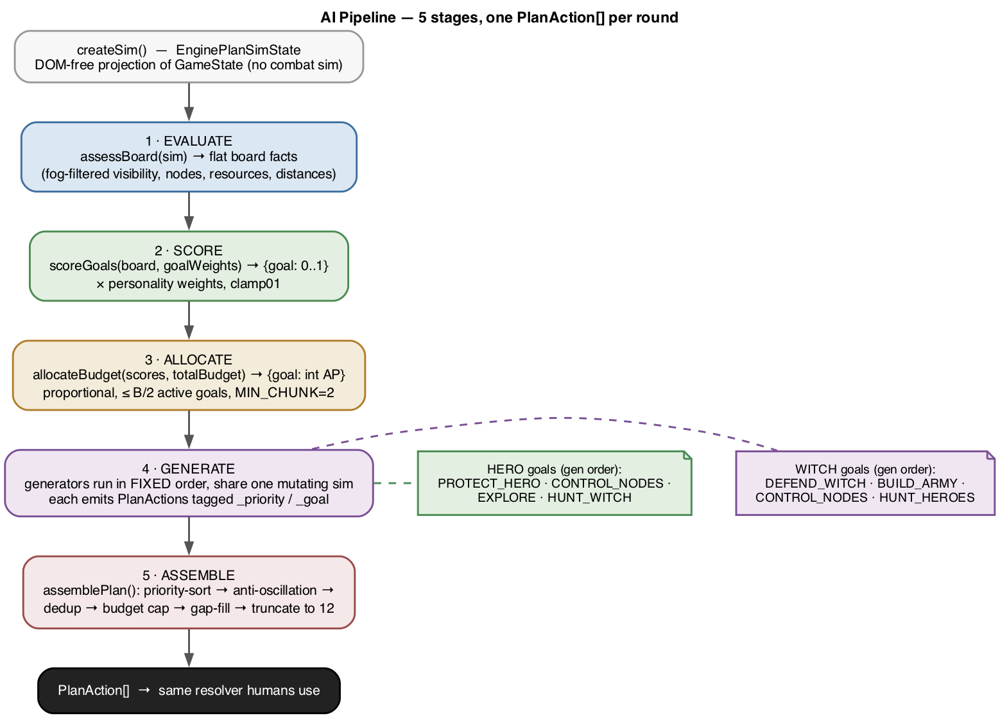

# Brimstone — AI System Specification

> **Document purpose:** a complete reference for the AI that plays both factions — the day-side
> **Hero AI** and the night-side **Witch AI** — detailed enough to reimplement an opponent that
> produces equivalent plans. Companion to `01-game-design-spec.md` (rules) and
> `03-client-behavior-spec.md` (client).

The AI is **not** a tree search or a learned policy. Each faction is a deterministic-shaped
**5-stage goal pipeline** that scores a small set of strategic goals, allocates the round's action
budget across them, runs per-goal action *generators* against a projected copy of the game state, and
assembles the results into a legal `PlanAction[]`. It calls the **same action functions humans call**
— it never cheats; it only sees what its fog model exposes.

> The reference's design docs (`docs/06`, `docs/design/ai-engine-*.md`) are materially **stale** — they
> describe 3 goals per faction with different weights and even older goal names. **The code is
> authoritative**; every number below is taken from source and the stale-doc deltas are listed in §13.

---

## 1. Overview & wiring

| Concern | Location |
|---------|----------|
| Shared base (`PlanSimState`, helpers, registries, difficulty, node feasibility) | `src/ai.js` |
| Witch engine (`WitchAIEngine`, `BaseAIEngine`, all stages, gap-fill) | `src/ai-engine.js` |
| Hero engine (`HeroAIEngine extends BaseAIEngine`) | `src/hero-ai-engine.js` |
| Shared pipeline driver | `BaseAIEngine.generatePlan()` |

The engines are instantiated **per AI-controlled seat**: offline in the local client, online per seat
on the server, and in the headless balance harness. The public contract is one call:

```
ai.generatePlan(allyContext?)  →  PlanAction[]
```

- Offline (single AI player) passes **no** `allyContext`.
- Online N-player passes a per-faction `allyContext = { claimedNodes: Set<hexKey>, allyPositions: [] }`
  shared across that faction's seats so allies don't fight over the same node (§11).

The returned plan is the *same* shape a human submits and is fed to the *same* resolver — there is no
privileged AI path through resolution.

---

## 2. The 5-stage pipeline

Both factions share one driver with an identical shape; only the goal set, the scoring functions, and
the generators differ.



```
generatePlan(allyContext):
  sim    = createSim()                                     // EnginePlanSimState — projected GameState
  board  = assessBoard(sim)                                // Stage 1 EVALUATE  → flat board facts
  board.allyContext = allyContext
  leader = getLeader(board)
  if (!leader) return generateLeaderlessPlan(sim, board)   // campaign "no leader" path
  scores = scoreGoals(board, cfg.goalWeights)              // Stage 2 SCORE     → {goal: 0..1}
  budget = allocateBudget(scores, board.totalBudget)       // Stage 3 ALLOCATE  → {goal: int AP}
  actions = []
  for gen in getGenerators(sim, board, budget, cfg):       // Stage 4 GENERATE  (FIXED order)
      actions.push(...gen.fn())                            //   each generator mutates the shared sim
  plan = assemblePlan(actions, sim, board, _prevPositions, gapFillFn)   // Stage 5 ASSEMBLE
  if (allyContext) updateAllyClaimedNodes(plan, board, allyContext)
  for e in sim entities owned by faction: _prevPositions.set(e.id, {col,row})   // anti-oscillation memory
  return plan
```

**Key properties:**

- **Generators run in a fixed order** (not score order) and share *one mutating `sim`*, so each
  generator sees the projected positions and resource spends of earlier ones.
  - Witch order: `DEFEND_WITCH → BUILD_ARMY → CONTROL_NODES → HUNT_HEROES`.
  - Hero order: `PROTECT_HERO → CONTROL_NODES → EXPLORE → HUNT_WITCH`.
- `_prevPositions` is a `Map` on the engine instance that **survives across rounds** — it is the
  cross-turn anti-oscillation memory (don't walk back onto last round's hex).
- Each generator is allocated a slice of the budget by Stage 3, but the final legality/cap is enforced
  in Stage 5.

---

## 3. `PlanSimState` — the projection model

The AI plans against a lightweight, DOM-free projection of `GameState`. **Combat outcomes are never
simulated** (the dice are unknown) — a battle action simply consumes one budget slot. Construction:

- `tiles` — a **shared read-only reference** to the real `state.tiles` (not cloned). Generators must
  not mutate tiles, with one deliberate exception: the hero fortify projection writes
  `tile.fortifyLevel` to model the per-plan cap (see §13.10).
- `entities` — **alive-only shallow clones**, re-parented to `Entity.prototype` so getters work;
  `items` deep-cloned (`structuredClone`) so equip/use projection can't corrupt the real backpack.
- `inventory` — deep JSON copy.
- `phase, round, cycleConfig, witchObjectives, nodeScore, fogOfWar` — copied.
- Leader refs `sim.hero` / `sim.witch`. In MP these scope to the planning `playerId` (own leader = the
  actor; the opposite faction's leader = the *nearest enemy leader*, used for flee/hunt distance).
- `actionsLeft` — the real action budget (`computeActions` / `computeActionsForPlayer`).
- `campaignAIBudgetBonus`, `aiDifficultyDelta`, `noWitchMission`, `playerCounts` (drives all NvN scaling).
- `_explored` (Set of in-plan explores), `_justLeft` (node-departure memory).

**Mutators** (each decrements `actionsLeft`): `applyMove` (records node departures), `applyBattle`,
`applyExplore`, `applySummon` (adds a fake minion at the leader, drains 2 resources), `applyGuard`,
`applySiege`, `applySoundHorn`.

`EnginePlanSimState` (and `HeroEnginePlanSimState`) extend it with:

- `departedHexes: Map<entityId, Set<hexKey>>` — records only the unit's **initial** position (recording
  intermediate stops broke multi-step road moves).
- `unitCommitments: Map<entityId, goalName>` — locks a unit to one goal so generators don't double-book it.
- `resourceLedger` — an independent copy of the faction inventory for projected resource spends.

---

## 4. Action budget & the valid plan

The base budget formula is the same one humans get (see `01-game-design-spec.md` §10.1):

```
computeBudget = base(3) + favorablePhaseBonus(+1) + min(unitCount, unitBonusCap) + nodeBonus,  capped at actionCap
```

| Faction | base | favourable phase | unitBonusCap | actionCap |
|---------|------|------------------|--------------|-----------|
| Hero | 3 | DAY or DAWN | 5 (survivors) | 8 |
| Witch | 3 | NIGHT | 4 (units) | 8 |

The engine's **`totalBudget`** (what it actually plans to) adds difficulty/campaign deltas:

```
AI_DIFFICULTY_BUDGET_DELTA = { easy: -1, normal: 0, hard: +1 }
Witch totalBudget = max(1, actionsLeft + campaignAIBudgetBonus + aiDifficultyDelta)
Hero  totalBudget = max(1, actionsLeft + aiDifficultyDelta)        // ⚠ omits campaignAIBudgetBonus (§13.5)
```

A valid plan = ordered `PlanAction[]`, length ≤ `MAX_PLAN_LENGTH (12)`, with ≤ `totalBudget`
AP-costing actions. **Free actions** (`USE_ITEM`, `EQUIP_WEAPON`, `SENT_TO` — cost 0 AP) don't count
against the budget; the engine's `FREE_ACTIONS` set bypasses the cap in assembly. The AI also tags each
action with `_priority` (lower = earlier) and `_goal` (debug only); these are meaningless at resolution
but drive Stage 5 ordering and the debug overlay.

---

## 5. Combat estimation (shared EV model)

Generators decide whether to attack using an **expected-value** model (no dice sampled). Expected die
values for best/worst-of-K pools (K = number of advantage dice − 1):

```
BEST_OF_K_EV  (K=0..4) = [3.5, 4.472, 4.958, 5.245, 5.431]
WORST_OF_K_EV (K=0..4) = mirror of best
expectedDieValue(net) = best-of for net>0, worst-of for net<0, 3.5 for net==0   (|net| capped at 3)
```

The estimate (witch `estimateCombat`, hero `estimateHeroCombat`):

```
isRanged    = range(attacker) > 1                 // ranged: no gang-up, no defender ally-defense
nightBonus  = (NIGHT && attacker is witch) ? 2 : 0
gangUpCount = isRanged ? 0 : own units (≠attacker) within 1 hex of defender
defAllyCount= isRanged ? 0 : enemy units (≠defender) within 1 hex of defender

expectedAtk = atk + attackBonus + nightBonus + min(gangUpCount,3) + expectedDieValue(min(gangUpCount,3))
expectedDef = def + defenseBonus + fortification + min(defAllyCount,3) + expectedDieValue(min(defAllyCount,3))
favorability = expectedAtk − expectedDef

classification:
  favorability > 3  → 'overwhelming'
  favorability > 0  → 'favorable'
  favorability > -3 → 'unfavorable'
  else              → 'suicidal'
```

`meetsEngageFloor(classification, floor)`:

| floor | attack when |
|-------|-------------|
| `suicidal` | anything except suicidal |
| `unfavorable` | favorable or overwhelming |
| `favorable` | overwhelming only |

> Each side's gang-up grants **both** a flat bonus *and* an advantage die — matching the real
> `executeBattle` (see `01-game-design-spec.md` §8.4). The witch estimator returns `expectedDamage` in
> raw 1/2 units; the hero estimator multiplies by `DAMAGE_SCALE` and exposes `canKill`. The two are not
> symmetric (§13.8) — only the classification matters to the witch generators.

---

## 6. Witch AI

Goals: **`BUILD_ARMY`, `CONTROL_NODES`, `DEFEND_WITCH`, `HUNT_HEROES`**.

### 6.1 Stage 1 — EVALUATE (`assessBoard`)

Produces a flat `board` object. Notable facts:

- Phase flags; `minions` (alive non-leader witch units), `minionCount`, `armyStrength` (Σhp).
- **Fog (radial, NOT line-of-sight):** witch leader sight **4**, minion sight **2**
  (`noWitchMission` → ∞). `visibleHeroes` = heroes within sight of any witch-side unit.
- `heroDistance` / `heroHpRatio` of the nearest visible hero.
- `nodes[]` per objective: `{controller, witchPresent, heroPresent (visible only), distToNearest}`;
  `witchHeldCount`, `heroHeldCount`, `heroOnNodeCount`.
- Resources: `metalCount`, `woodCount`, `canAffordSummon (≥2)`, `bestSummonType`
  (metal≥2 → Iron Golem, wood≥2 → Wood Golem, else Minion).
- `unexploredBuildings`, `roundsToScoring`, `enemiesNearWitch` (visible heroes ≤3),
  `woundedEnemies` (visible <50% hp), `visibleSurvivors`, `minionsNearWitch` (≤2 of witch),
  `totalBudget`, `witchPlayerCount`, `heroPlayerCount`.

### 6.2 Stage 2 — SCORE (`scoreGoals`)

All scores are `clamp01`. **Verbatim:**

**DEFEND_WITCH**
```
hasArmyProtection = minionsNearWitch >= 2
if !hasArmyProtection:
  witchHpRatio < 0.25 → 1.0 ; < 0.4 → 0.6 ; < 0.5 → 0.3
  if heroDistance <= 2 && witchHpRatio < 0.5: defend = max(defend, 0.8)
  if enemiesNearWitch > minionCount + 1:      defend = max(defend, 0.7)
else: if witchHpRatio < 0.2: defend = 0.5
```

**BUILD_ARMY** (`perWitchMinions = minionCount / witchPlayerCount`, `nodeCount = nodes.length || 3`)
```
perWitchMinions < nodeCount     → 0.9
                < nodeCount + 2  → 0.6
                < nodeCount + 3  → 0.35
                else             → 0.15
if canAffordSummon: army = max(army, 0.75)
if !canAffordSummon && no unexploredBuildings: army *= 0.3
if round <= 4 && perWitchMinions < 3: army = max(army, 0.9)
```

**CONTROL_NODES** (base `0.60` in NvN else `0.45`)
```
uncovered = nodes where controller != witch OR !witchPresent ; control += uncovered * 0.1
if heroScore >= 3: +0.3 ; if heroHeldCount > 0: +0.2 ; if heroHeldCount > witchHeldCount: +0.25
if heroOnNodeCount > 0: +0.3
if roundsToScoring <= 3: +0.1 ; <= 2: +0.15 ; <= 1: +0.15
if witchScore > heroScore: +0.1 ; if witchScore >= 3: +0.1
control = clamp01(clamp01(control) * (isDawnOrDusk ? 1.8 : 1.0))
if uncovered == 0: control *= 0.8
```

**HUNT_HEROES** (only if `visibleHeroes > 0`)
```
hunt = 0.4
if woundedEnemies > 0: max(hunt, 0.8)
if visibleSurvivors > 0: max(hunt, 0.65)
if isNight: +0.15
if heroHpRatio < 0.4 && heroDistance <= 4: max(hunt, 0.95)
if gangUpReady (some hero has >=2 minions within 2): max(hunt, 0.75)
if roundsToScoring <= 1: hunt *= 0.5
```

Then **personality multiply**: `scores[g] = clamp01(scores[g] * goalWeights[g])`. Then an **early-game
override**: if `visibleHeroes == 0 && unexploredBuildings > 0 && perWitchMinions < nodeCount + 1` then
`BUILD_ARMY += 0.4`, `DEFEND_WITCH = min(., 0.1)`, `HUNT_HEROES = 0`.

### 6.3 Stage 3 — ALLOCATE (`allocateBudget`, shared by both factions)

```
URGENCY_THRESHOLD = 0.05 ; MIN_CHUNK = 2
qualifying = goals with score > 0.05, sorted desc by score
if none: dump the entire budget into the first goal key
maxActive = max(1, floor(totalBudget / 2))            // at most B/2 active goals
active    = qualifying.slice(0, maxActive)
totalUrgency = Σ active scores
result[g] = floor( (score / totalUrgency) * totalBudget )   // proportional
distribute remainder round-robin (highest score first)
// MIN_CHUNK guarantee: an active goal stuck at 0<AP<2 steals from the lowest-priority active goal with >2
```

Output: `{ goal: integer AP }`.

### 6.4 Stage 4 — GENERATE (witch generators)

`_closestUncommitted(sim, board, target, preferMinions)` picks the nearest unit not already committed
to a goal.

**`genDefendWitch`**
1. HEAL (1 AP) if herbs > 0 and `witchHpRatio < 1.0` (`_priority 0`).
2. Flee: `fleeThreshold = config.fleeThreshold ?? 0.2`; `hasArmyProtection = minionsNearWitch >= 3`.
   `shouldFlee` = army ? `hpRatio < 0.15` : (`hpRatio <= fleeThreshold` OR `enemiesNearWitch > minionCount+1`).
   While fleeing with visible heroes: commit the witch and `stepAwayFrom` the nearest hero until budget
   gone or distance > 4 (`_priority 1`).
3. Interpose: if `heroDistance <= 3` and minions exist, move up to 2 nearest minions toward the witch.

**`genHuntHeroes`** — score targets (`+5` if hp ≤ 7, `+3` if hpRatio < 0.5, `+2` survivor, `+2` if
hpRatio < 0.3, `+nearbyMinions`), sort desc. Per target: up to 3 closest uncommitted units (gang-up);
if `dist ≤ range` and estimate ≠ suicidal → `BATTLE_UNIT`; else if `dist ≤ pursuitRange` (4, or **8** in
`noWitchMission`) commit and step ≤3 toward it (or `BATTLE_HEX` a blocking wall), attacking when in
range (accepts *unfavorable* — "attrition wins").

**`genBuildArmy`** *(uses `Math.random` — see §10)* — only the witch leader explores/summons:
1. `_trySummons`. 2. explore the current hex if unexplored, retry summon. 3. move toward
`_pickExploreBuilding` (random among the closest 3) up to 3 steps, opportunity-attack adjacent foes
(night also takes *unfavorable*), `EXPLORE` on arrival, summon. Else wander toward a random unexplored hex.
`_trySummons`: `armyCap = (isNight||DUSK ? 10 : 7) + 4*(witchPlayerCount-1)`; while budget and
`army < cap` and `ledger ≥ 2`, summon Iron/Wood/Minion by affordability, draining the ledger (`_priority 2`).

**`genControlNodes`** — `feasibilityFloor = NvN ? 0.05 : 0.1`. Target nodes not safely witch-held,
scored by `scoreNodeFeasibility(., 'witch', .)`, dropped below floor / ally-claimed. **Sort:** hero-held
(0) > neutral (1) > witch-present (2), then `distToNearest`. `unitsPerNode`: NvN baseline (teamSize ≥ 3
? 3 : NvN ? 2 : 1); scoring imminent (≤2) → `max(3, base)`; ≤4 → `max(2, base)`; `maxStepsPerUnit`
= imminent ? 4 : 3; `effectiveUnits = max(unitsPerNode, enemyOnNode ? 3 : 1)`. Per unit (prefer
minions): on node → fight all enemies in range (no gate); else GUARD if a threat is within 2, else move
toward the nearest node hex (BATTLE_HEX walls when closer), opportunity-attacking en route.

### 6.5 Stage 5 — ASSEMBLE (`assemblePlan`, shared)

1. Sort by `_priority` ascending (default 99).
2. **Anti-oscillation** (iterate end→start): drop a MOVE whose destination is in
   `departedHexes[entityId]` or equals `prevPositions[entityId]` (last round's position).
3. **Dedup** by key (`id:move:col,row`, `id:battle:targetId`, else `id:type`).
4. **Budget cap**: free actions always kept; others kept while `apUsed < totalBudget`.
5. **Gap-fill** leftover AP via the faction's gap-fill function.
6. Truncate to `MAX_PLAN_LENGTH (12)`.

Witch **gap-fill** (`_fillGaps`), in priority order: (1) move uncommitted minions toward the nearest
visible enemy ≤5 (attack if adjacent & non-suicidal); (2) toward the nearest uncovered node
(feasibility ≥ 0.1); (3) witch EXPLORE current hex; (4) witch toward the nearest uncovered node;
(last) wander to the nearest unexplored non-river/footprint hex — all respecting `prevPositions`.

**Witch leaderless plan** (campaign no-witch missions) — a 4-pass over the real minions: (1) all
adjacent attackers hit the weakest hero; (2) units exactly 2 away move-adjacent-then-attack; (3) others
step toward the weakest hero; (4) a second attack if now adjacent. Capped at `MAX_PLAN_LENGTH`.

---

## 7. Hero AI

Goals: **`EXPLORE, CONTROL_NODES, PROTECT_HERO, HUNT_WITCH`**.

### 7.1 Stage 1 — EVALUATE (`assessHeroBoard`)

- `heroHpRatio`; `survivors` (type SURVIVOR only), `survivorCount`.
- **Fog (true line-of-sight):** `heroLosSet = computeLineOfSight(sim, 'hero')` — forests and building
  footprints occlude; per-entity sight (rogue +1, `scout`) handled inside. Witch units outside LOS are
  simply absent from the board.
- `witch` = nearest visible night-side leader (or null), `witchVisible`, `witchDistance`,
  `witchHpRatio`; `witchMinions` (visible non-leaders).
- `nodes[]` {controller, heroPresent, witchPresent (any witch unit), distToHero, distToNearestHeroUnit},
  `heroHeldCount`, `witchHeldCount`.
- Resources `herbCount/foodCount/woodCount/metalCount`; `heroWeapons` (unequipped weapons the hero's
  concrete faction may equip — rogue refuses melee); `unexploredBuildings`, `nearestUnexploredDist`,
  `heroOnNode`, `heroInBuilding`, `heroTileExplored`, `heroTileFortLevel`, `nearestEnemyDist`,
  `roundsToScoring`, `totalBudget` (no campaign bonus), player counts.

### 7.2 Stage 2 — SCORE (`scoreHeroGoals`)

**PROTECT_HERO**
```
heroHpRatio < 0.15 → 0.8 ; < 0.25 → 0.4
if herbCount > 0 && heroHpRatio < 0.7: max(protect, 0.2)
```

**EXPLORE** (`nodeCount = nodes.length || 3`)
```
survivorCount == 0 → 1.0
survivorCount < nodeCount && unexploredBuildings > 0 → 0.6
else → (unexploredBuildings > 0 ? 0.1 : 0)
if heroInBuilding && !heroTileExplored: +0.3
if isNight: explore *= 0.7
```

**CONTROL_NODES** (base `0.5`)
```
uncovered = nodes (controller != hero && !heroPresent) ; control += uncovered * 0.12
if survivorCount >= 1: +0.15
if witchHeldCount >= 2: +0.4
scoreDiff = heroScore − witchScore ; if < 0: +0.25 ; if <= -2: +0.3
if witchScore >= 3: +0.3
if roundsToScoring <= 2: +0.4 ; elif <= 4: +0.2
if isDawnOrDusk: control *= 1.8
```

**HUNT_WITCH** (only if `witchVisible`)
```
witchDistance <= 3 → 0.4 ; elif <= 5 → 0.2
if witchHpRatio < 0.4: max(hunt, 0.7) ; elif < 0.6: +0.2
if isDay: +0.1
if roundsToScoring <= 2: hunt *= 0.3
if heroHpRatio < 0.3: hunt *= 0.1
```

Then **personality multiply**. Then **early-game override**: if
`nearestEnemyDist > 4 && unexploredBuildings > 0` then `EXPLORE += 0.4`, `PROTECT_HERO = min(., 0.1)`;
if `nearestEnemyDist === Infinity` then `PROTECT_HERO = 0`.

### 7.3 Stage 3 — ALLOCATE: identical `allocateBudget` (§6.3).

### 7.4 Stage 4 — GENERATE (hero generators)

**`genProtectHero`** — HEAL the hero (herbs, hpRatio < 1.0, `_pri 0`); HEAL injured survivors
most-wounded-first; free `EQUIP_WEAPON` the best weapon if none equipped; EXPLORE the current building.
Flee: `shelterThreshold = config.shelterThreshold ?? 0.4`; if `heroHpRatio < threshold` and a witch
unit is within 2 → move toward the nearest building (or `stepAwayFrom`). Night-shelter the hero and
adjacent survivors when low.

**`genExplore`** — HEAL if hpRatio < 0.8; EXPLORE the current building; `SOUND_HORN` (1 food + 1 AP) if
`survivorCount < survivorCeiling` (= `heroCount > 1 ? nodeCount : nodeCount + 1`) and ≥1 unexplored
building; move ≤3 toward the nearest unexplored building, opportunity-fight adjacent foes at
`exploreEngageFloor = isDay ? 'suicidal' : (config.engageFloor ?? 'unfavorable')`, EXPLORE on arrival;
`FORTIFY` the current tile (building or node only) up to `fortifyCap`
(`isNight||DawnDusk ? fortifyCapNight : fortifyCapDay`), spending metal-first.

**`genControlNodes`** — `engageFloor = isDay ? 'suicidal' : (config.engageFloor ?? 'unfavorable')`;
`feasibilityFloor = isDay ? 0 : 0.05`. Targets = nodes not safely hero-held OR witch-threatened (≤2),
scored `scoreNodeFeasibility(., 'hero', .)`, **sorted by `distToNearestHeroUnit`**. Per node:
`overwhelmCap = NvN ? 2 : 3`; `unitsForNode = enemyOnNode ? overwhelmCap : (contested ? 2 :
(scoringImminent ? 2 : 1))`. Per unit (prefer survivors): on node → fight all enemies ≤1 (no gate),
GUARD after if it is the hero, FORTIFY the node hex; else move toward the node, fighting adjacent
enemies that meet `engageFloor` (any odds if `enemyOnNode`).

**`genHuntWitch`** — targets: in-range minions (priority 2), then the witch (priority 1) unless
`tooRisky` (`heroHpRatio < 0.3 && ≥3 minions within 2 of witch`). Use the hero for the witch, any
uncommitted unit for minions. In range & non-suicidal (always attack the witch) → `BATTLE_UNIT`. Else
pursue: `pursuitRange = (isEnemyLeader ? 6 : 2) + (unitRange − 1)`, step ≤ (leader ? 4 : 2), attack on
arrival.

### 7.5 Stage 5 — ASSEMBLE: identical `assemblePlan`; gap-fill = `fillGapsHero`:

(1) hero attacks an adjacent enemy / GUARDs if an enemy is within 2; (2) EXPLORE the current hex;
(2b) `SOUND_HORN` if `survivorCount < nodeCount`; (3) hero to the nearest unexplored building if it
needs survivors; (4) uncommitted survivors → nearest uncovered node; (5) hero → nearest uncovered node;
(6) last-resort explore/move to the nearest unexplored (prefer a building). All respect `prevPositions`.

The hero has **no** leaderless plan (returns `[]`).

---

## 8. Personality registries (exact tables)

A personality is a config object: `goalWeights` (multiplied into Stage-2 scores) plus a few combat/flee
knobs. Unknown keys fall back to `balanced`.

### 8.1 Witch — `PERSONALITY_CONFIGS`

| key | BUILD_ARMY | CONTROL_NODES | DEFEND_WITCH | HUNT_HEROES | fleeThreshold | engageFloor | campaign-only |
|-----|-----------|---------------|--------------|-------------|---------------|-------------|---------------|
| `balanced` (default) | 1.2 | 1.4 | 0.6 | 1.0 | 0.20 | suicidal | – |
| `aggressive` | 1.0 | 1.3 | 0.3 | 1.3 | 0.15 | suicidal | – |
| `swarm` | 1.5 | 1.4 | 0.6 | 0.9 | 0.20 | unfavorable | – |
| `evasive` | 0.6 | 0.05 | 2.5 | 0.1 | 0.70 | favorable | yes |

`fleeThreshold` is the actively-used knob (in `genDefendWitch`); most witch combat gates are hardcoded.

### 8.2 Hero — `HERO_PERSONALITY_CONFIGS`

| key | EXPLORE | CONTROL_NODES | PROTECT_HERO | HUNT_WITCH | engageFloor | shelterThreshold | fortifyCapDay | fortifyCapNight | campaign-only |
|-----|---------|---------------|--------------|------------|-------------|------------------|---------------|-----------------|---------------|
| `balanced` (default) | 1.0 | 1.4 | 0.6 | 0.9 | suicidal | 0.20 | 2 | 3 | – |
| `aggressive` | 0.7 | 1.2 | 0.3 | 1.4 | suicidal | 0.15 | 1 | 3 | – |
| `defensive` | 0.9 | 1.4 | 0.8 | 0.7 | unfavorable | 0.30 | 2 | 4 | – |
| `explorer` | 1.6 | 1.2 | 0.5 | 0.8 | suicidal | 0.20 | 2 | 3 | – |
| `node_denier` | 0.3 | 2.2 | 0.4 | 0.2 | suicidal | 0.15 | 1 | 2 | yes |
| `witch_hunter` | 0.3 | 0.4 | 0.3 | 2.5 | suicidal | 0.15 | 1 | 2 | yes |

### 8.3 Selection & friendly labels

Each personality is auto-registered as a `BaseAIEngine` subclass. The friendly UI labels
(`PERSONALITY_LABELS`) map: Balanced, Aggressive, Defensive, Explorer, Hoarder, Swarm. The
**random AI fill-in pool** (matrix-balance-validated) is `hero: [balanced, aggressive, defensive,
explorer]`, `witch: [balanced, aggressive, swarm]`; `node_denier`/`witch_hunter`/`evasive` are
campaign/admin-only and excluded from rotation. (CLAUDE.md friendly names map: Hero
Berserker=aggressive, Sentinel=balanced, Scavenger=explorer; Witch Berserker=aggressive, Swarm=swarm.)

> ⚠ **`hoarder` is orphaned** — it has a label but **no config**, so selecting it silently falls back to
> `balanced` (§13.3).

---

## 9. Fog of war — how the AI plans blind

- **Witch:** plain **radial distance**, no LOS. Leader sight 4, minion sight 2 (`noWitchMission` → ∞).
  Visibility gates the hero-presence facts feeding DEFEND/HUNT/CONTROL.
- **Hero:** true `computeLineOfSight(sim, 'hero')` — forest/footprint occlusion, per-entity sight
  (scout/rogue bonus). Witch units outside LOS are simply absent.
- The real `GameState.fogOfWar` is `'partial'` whenever any side is AI, else `'none'`. The AI does not
  cheat — it reasons only over what its sight model exposes.

---

## 10. Determinism / RNG

- The pipeline is mostly pure, **but witch `genBuildArmy` uses `Math.random()`** (random pick among the
  closest 3 explore-buildings, and random wander target). So a witch plan is **not** reproducible from
  `(state)` alone.
- **Hero generators contain no `Math.random()`** — hero planning is deterministic given the board.
- No seeded RNG is threaded into the engines. (Online turn-timing jitter and random personality pick
  also use `Math.random` but are outside planning.)
- This does **not** break replay: replay reproduces *resolution*, not plan generation. But two AI runs
  from identical state can differ. A reimplementation that needs reproducible AI must seed an RNG.

---

## 11. Multiplayer (NvN) coordination

`generatePlan(allyContext)` receives `{ claimedNodes: Set<hexKey>, allyPositions: [] }` shared across one
faction's seats (seats plan **sequentially**). Generators skip nodes whose hexes are in `claimedNodes`;
after planning, `updateAllyClaimedNodes` adds every node a MOVE lands on to the set, so later allies
avoid earlier claims.

NvN scalers (all gated on `playerCount > 1`; 1v1 is unchanged): witch minion cap `+4` per extra witch;
per-witch BUILD_ARMY/CONTROL thresholds; CONTROL base 0.45 → 0.60; witch `unitsPerNode` 1 → 2 → 3; hero
`overwhelmCap` 2 (vs 3); feasibility floor 0.05; hero `survivorCeiling` tightened to `nodeCount`.

---

## 12. Balance baseline & tuning

Baseline (500 1v1 games, Standard 14×14, `normal` difficulty): **Hero ≈ 43 % / Witch ≈ 57 %, mean ≈ 22
rounds, kill-wins ≈ 50 %, tiebreaks ≈ 0.2 %, round-cap ≈ 0.2 %.** Targets: win rate 38–62 % either side,
tiebreaks < 10 %, kill-wins ≥ 20 %, mean rounds 15–35, round-cap < 5 %. All map sizes lean witch
(longer games → more night/summon time); to re-centre Standard, shrink map area toward 13×13 — tuning
combat constants won't move the split.

**Validation commands** (run after any AI/gameplay change):
```bash
node scripts/headless.js 500 standard            # win rates & game length
node scripts/combat-sim.js 200                   # hit/crush/counter rates
node scripts/ai-matrix.js 50                     # cross-personality matrix
node scripts/headless.js 500 standard --players N # N ∈ {2,3,4}
```

**Primary tuning knobs:** per-personality `goalWeights` and the flee/shelter/engage/fortify knobs; the
SCORE-stage literal thresholds; `allocateBudget` `URGENCY_THRESHOLD`/`MIN_CHUNK`; the summon cap;
`unitsPerNode`/`overwhelmCap`; feasibility floors; `scoreNodeFeasibility` weights; faction
`unitBonusCap`/`actionCap`; `MAX_PLAN_LENGTH`; `DAMAGE_SCALE`.

> A subtlety when tuning: Stage-2 applies the personality weight then `clamp01`. A weight > 1 on a score
> already ≥ 1.0 is a no-op past the clamp; weights chiefly affect *mid-range* scores and the relative
> ordering that feeds `allocateBudget`.

---

## 13. Notes & known discrepancies for reimplementers

1. **Goal counts:** the design docs describe **3** goals/faction; the code has **4** (witch adds
   `HUNT_HEROES`, hero adds `HUNT_WITCH`). Some docs even name an obsolete set (`KILL_HERO`,
   `GATHER_RESOURCES`). Use §6/§7.
2. **Weights:** doc personality tables don't match code (e.g. doc witch balanced 1.0/1.0/1.0 vs code
   1.2/1.4/0.6/1.0). Use §8.
3. **`hoarder`** has a label but no config → falls back to `balanced`.
4. **Witch caps:** an inline comment says "cap +3 / hard cap 10"; the real values are `unitBonusCap 4`,
   `actionCap 8`.
5. **Hero `totalBudget` omits `campaignAIBudgetBonus`** that the witch keeps — a possible campaign-mode
   asymmetry; confirm intent before relying on it.
6. **Witch planning is non-deterministic** (`Math.random` in `genBuildArmy`); hero planning is
   deterministic.
7. **`_heroSightBase`** (DAY 3 / NIGHT 1 / DAWN-DUSK 2) is defined but unused — visibility comes from
   `computeLineOfSight`. Treat as dead code.
8. **Asymmetric estimators:** witch `estimateCombat` returns raw 1/2 `expectedDamage` with no `canKill`;
   hero `estimateHeroCombat` multiplies by `DAMAGE_SCALE` and exposes `canKill`. Only the classification
   is used by the witch.
9. **Clamp ceiling** on personality multiply (see §12 note).
10. **Hero fortify projection mutates the shared `tiles` reference** (`tile.fortifyLevel`) to model the
    per-plan fortify cap, even though `PlanSimState.tiles` is nominally read-only. Verify this projection
    does not leak into resolution in a port.

---

*End of AI System Specification.*
