# Brimstone — Client Behavior Specification

> **Document purpose:** a complete reference for the **browser client** — its modes, every UI surface,
> the planning interactions, the camera/input model, and how it presents resolution, replays, and
> conversations — detailed enough to reimplement the client identically. Companion to
> `01-game-design-spec.md` (rules + server) and `02-ai-system-spec.md` (AI).
>
> The client is **vanilla JavaScript ES modules, no build step**, with a Babylon.js WebGL renderer.
> Screenshots in this document were captured by driving the real game in headless Chromium via the
> repository's `verifier-browser` harness.

---

## 0. The client's place in the system

The client never owns game rules. It:

1. **Drives planning** — lets the player build a `PlanAction[]` and submits it to the authority
   (offline: the local client *is* the authority and resolves locally; online: the server resolves).
2. **Replays resolution** — animates the `steps[]` the authority produced. It **never re-runs the
   resolver**; replay reproduces, it never authors state (the "Sim/Show split" — §8).
3. **Renders** the board and presents conversations, combat cinematics, and summaries.

Everything the player sees is pushed into a render-only layer; the renderer mutates no state.

---

## 1. Architecture & module wiring

| Layer | File(s) | Responsibility |
|-------|---------|----------------|
| **Orchestration** | `src/main.js` (~10k lines) | Client entry. Wires modules, **owns every `setMode()`**, runs the local & online/async resolution loops, drives setup → game → summary → menu. Holds module-level `state`, `renderer`, `ui`, `witchAI`, `heroAI`, `mp`. |
| **Menu** | `src/menu/ledger.js`, `menu/thumbnails.js`, `main-menu-games.js`, `server-selector.js` | The **Ledger** (rail + pane). Calls back into `main.js` through a callback bag (`_buildLedgerData()`). |
| **DOM / UI** | `src/ui.js` (UIController, ~7k lines — **the only DOM-touching gameplay layer**), `ui-elements.js` (id→element registry), `ui-popup.js` (arc-menu positioning), `ui-render.js` (pure HTML builders) | Bridges input → actions; renders HUD/overlays/dialogs/toasts. **Reads `ui.appMode`, never sets it.** |
| **Renderer** | `src/renderer-3d.js` (Babylon WebGL — *the* shipped renderer), `overlays.js` (z-band overlay model), `renderer.js` (2D, editor-only) | Render-only, zero state mutation. |
| **State** | `src/game.js`, `entities.js`, `tiles.js`, `hex.js`, `map.js` | `GameState`, combat math, tiles `Map`. No DOM. |
| **Rules** | `src/actions.js`, `src/planner.js` | Pure `(state, actor, …)` mutations; `computeGhostState`, `validatePlanAction`. |
| **Resolution** | `server/resolver.js` | Imported directly by `main.js` for **local** resolution — the same module the server uses online. |
| **AI** | `src/ai.js`, `ai-engine.js`, `hero-ai-engine.js` | Local plan generation (see `02-ai-system-spec.md`). |
| **Net** | `src/multiplayer.js` | WebSocket client; `MirrorState`/`MirrorEntity` (read-only mirror); live + async. |
| **Replay / cinematic** | `src/playback.js`, `replay-timeline.js`, `conversation-player.js`, `combat-cinematic.js`, `combat-presentation.js` | Resolution playback presentation. |
| **Campaign** | `src/campaign/*` | Missions, conductors, story/logic graph, conversations. |
| **Keybinding** | `src/keybindings.js` | Global keyboard + `/`-console. |

**Boot:** unless a special URL param is present (`?scenario=`, `?replayGame=`, `?spectate=`, `?room=`),
the client hides the legacy `#setup-screen`, lazy-imports `ledger.js`, and shows the **Ledger** (default
landing: the *Battle Log* / resumable games). A MutationObserver re-shows the Ledger whenever the game
returns to menu. Special URL modes take over `#game-screen` directly and skip the Ledger.

> Two cross-cutting truths a reimplementation must honour (and which supersede older internal docs):
> **(a)** the 3D renderer is the *only* renderer at runtime (`_pickRenderer()` unconditionally returns
> `Renderer3D`); **(b)** the menu *is* the Ledger — the legacy `#setup-screen` step machine is dead.

---

## 2. App modes & the transition machine

`AppMode` is a frozen enum with module-private `_current`/`_previous` and a listener list. Helpers:
`getMode()`, `getPreviousMode()`, `setMode(m)` (no-op if unchanged; fires listeners), `onModeChange(fn)`,
`isInGame()` (not MENU/SPECTATING), `isAnimating()` (RESOLVING or PLAYBACK), `shouldBufferMessages()`
(RESOLVING/SUMMARY/PLAYBACK — incoming server messages are queued and applied on return to PLANNING).

| Mode | Meaning |
|------|---------|
| `MENU` | Browsing the Ledger/lobby. Game callbacks are no-ops. |
| `PLANNING` | In a game, building a plan (not yet resolving). |
| `SUBMITTED` | Plan locked, waiting — **reconnect-only** (see note). |
| `RESOLVING` | Animating the current round's resolution (also re-watch, async/cached replay, and pre-planning conversations). |
| `SUMMARY` | Post-resolution wrap-up (doubles as the non-campaign game-over screen). |
| `PLAYBACK` | Full-game replay viewer (own transport controls). Exits to MENU. |
| `SPECTATING` | (Reserved — see note.) |

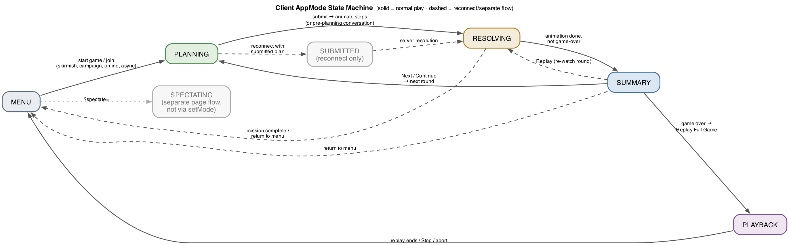

**Two important realities** (the older state-machine doc is idealised here):

- **`SUBMITTED` is effectively dead in normal play.** Both local and online submission keep `AppMode`
  at **PLANNING** and use a *UI-level* `ui._planSubmitted` flag to paint the "waiting for opponents"
  chrome; resolution then flips straight to RESOLVING. The only real `setMode(SUBMITTED)` is the
  **reconnect-restore** branch (rejoining an online game whose plan was already submitted). Treat
  `SUBMITTED` as optional.
- **`SPECTATING` is never entered via `setMode`.** Spectating is a separate page-level flow
  (`initSpectator`) that builds its own UIController in a *UI*-mode (`UIMode.SPECTATOR`); `AppMode`
  stays MENU.

`setMode` is called from three modules: `main.js` (all gameplay transitions), `playback.js` (enter/exit
PLAYBACK), and `conversation-player.js` (RESOLVING for a pre-planning conversation).

---

## 3. The setup flow — the Ledger

The front-of-app is a single-frame **rail + pane** ("Caleb's Hollow"). The rail has six destinations:

| Rail item (`data-dest`) | Purpose |
|-------------------------|---------|
| `continue` — **Battle Log** | Resumable games-in-progress (default landing). |
| `campaign` — **Campaign** | Save slots → mission list → briefing → Begin. |
| `skirmish` — **Skirmish** | Pick a Day/Night champion + map-size/node/difficulty/resources → Start vs AI. |
| `others` — **Play Online** | Create/join lobbies, async games, the persistent two-week Battle. |
| `replays` — **Replays** | Revisit completed games (→ full-game PLAYBACK). |
| `account` — **Account** | Identity / leaderboard. |

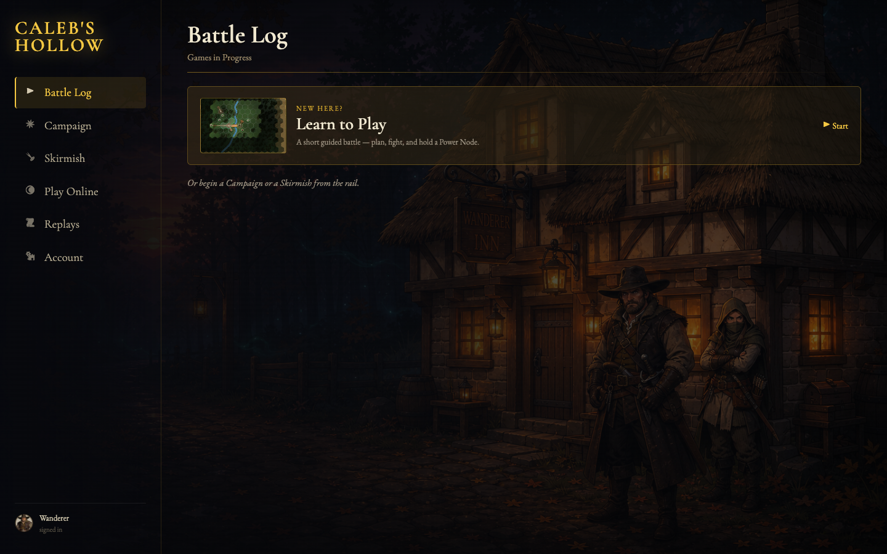

**Skirmish** — picking a Day champion makes the hero human and the witch AI (and vice-versa); a random
available enemy faction is chosen; `init(witchIsAI, heroIsAI, false, factionId, {mapSize, nodeCount,
aiDifficulty, startingResources, enemyFactionId})` builds the `GameState`, sets fog to `partial` for
human-vs-AI, constructs the AIs, sets up the UI, and starts the local planning phase.

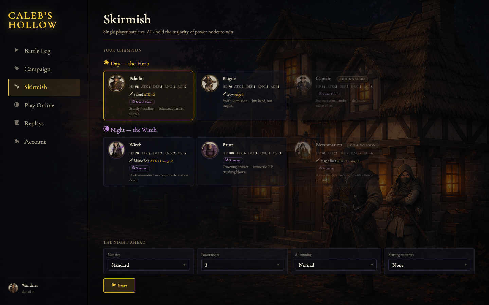

**Campaign** — a save slot opens a mission list; a mission opens a briefing (with a party/deploy
preview) and a **Begin Mission** button (`[data-testid="begin-mission"]`). Missions can open on a
turn-0 conversation. The post-mission **Debrief** overlay shows Victory/Defeat + surviving roster, then
returns to the Campaign panel.

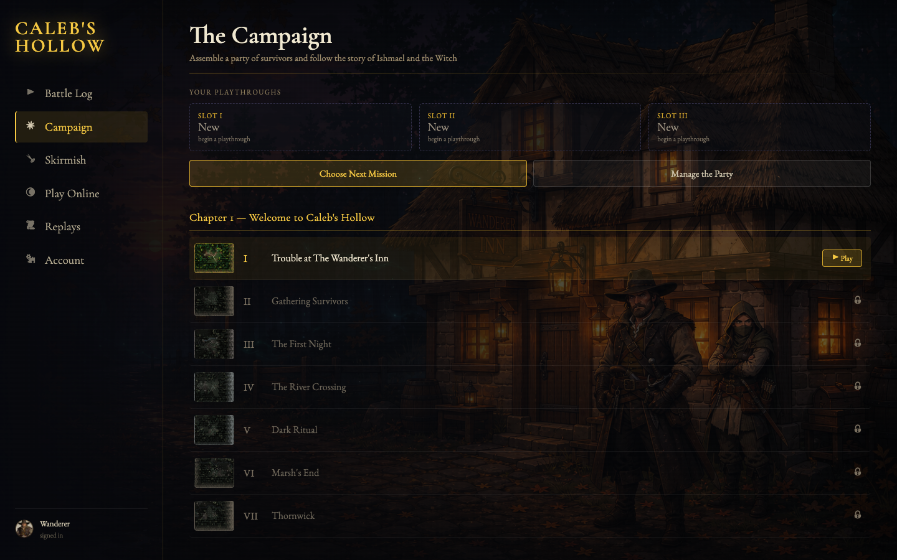

**Play Online** — `lobby.create/join/browse/claimSlot/setFaction/setSlotAI/fillAllWithAI/start/leave/invite`,
all via a lazy authenticated WebSocket connection. The lobby view (the "Waiting Card" equivalent) shows
the seat grid, faction picks, AI-fill, and ready/start. Starting routes through `initOnline` → PLANNING.

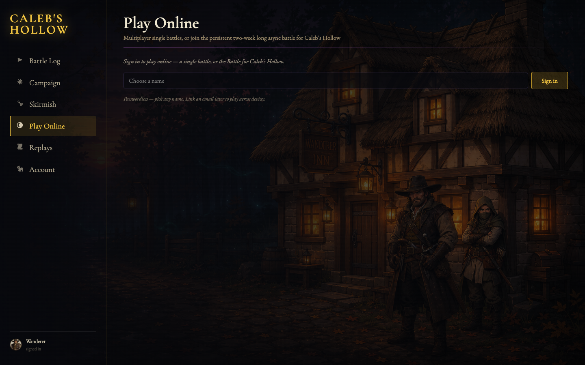

**Learn to Play** launches a guided tutorial (fixed map, conductor-gated first rounds, then witch AI).
**AI-vs-AI autoplay** (`init(true, true, true, …)`) runs resolution-only with no planning phase.

> There is **no** standalone Options / New-Game card any more — those selects live inline in the Ledger
> Skirmish/Campaign panels and are passed as `opts` into `init`.

---

## 4. In-game UI surface catalog

Surfaces use the project's canonical terminology. **Overlays** dim the canvas and are manually
dismissed; **Dialogs** require interaction; **Toasts** auto-dismiss; **HUD** is persistent.

### 4.1 HUD (persistent during a game)

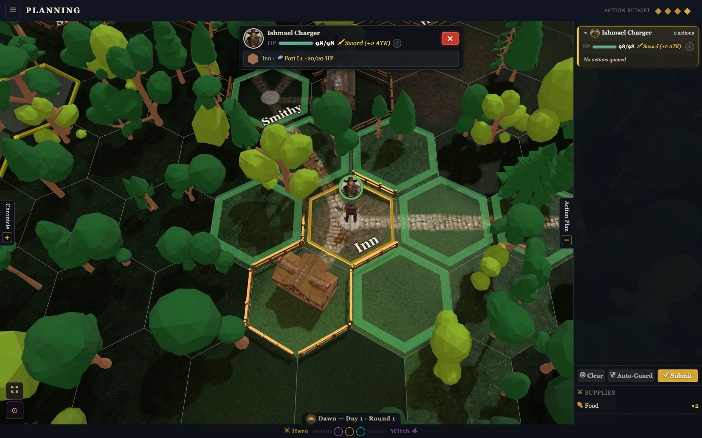

| Surface | DOM | Shows |
|---------|-----|-------|
| **Game Header** | `#game-header` (`#menu-btn`, `#replay-turn-btn` ↺, `#end-turn-btn` ↩, `#plan-return-btn`) | Top bar. |
| **Turn Info** | `#turn-info` | "Planning" (+budget) / "Waiting for Opponents…" / "Resolution". |
| **Budget Badge** (Action Budget) | `.action-budget` in Turn Info | Colour-coded diamond pips (base/phase/unit/node/food) + a breakdown tooltip. |
| **Node Status** *(not "score bar")* | `#score-bar` | Per-node control dots + per-faction score pips; tap → Cycle Info popup. |
| **Cycle Bar** *(not "turn bar")* | `#cycle-bump` | Phase pill: sprite + "Dawn — Day X · Round Y"; fixed-end missions add a deadline track. |
| **Mini Chronicle** | `#chronicle-sidebar` | Left-edge collapsible: Mission Log (objective checklist) over the Chronicle event log. |
| **Unit Stats Bar** *(not "entity panel")* | `#unit-stats-bar` | Selected unit: portrait, name+level, HP bar, weapon, effects, (i)→ATK/DEF/RNG/AGI + ability, XP (campaign), terrain/node badge, cycle ‹›, ✕ deselect. |
| **Plan Panel / Tab / Steps List** | `#plan-panel` / `#plan-tab` / `#plan-steps` | Right slide-in: per-unit plan blocks + cost badges, food row, footer (Clear / Auto-Guard / Submit / Return), player ready-list, inventory. |
| **Undo Button Layer** | `#undo-button-layer` | Floating UNDO over the last-queued-action hex of the selected unit. |
| **Compass Rose / zoom controls** | `#compass-rose`, `#zoom-controls`, `#camera-controls-3d` | Camera heading needle; pan/zoom/rotate/fit/focus. |

### 4.2 Overlays (dim/cover canvas, manually dismissed)

- **Chronicle sidebar** (`#chronicle-sidebar`) — the live in-game event log + mission-log objective
  checklist (the full-screen `#chronicle-overlay` modal is dormant).
- **Tile Detail** (`#tile-zoom-overlay`) — tap any hex for a ~3× SVG hex card: terrain/building icon,
  fortify ring, node/fortify info, and unit cards (clicking a unit card selects it).
- **Inventory** (`#plan-inventory`) — the faction resource stash, shown inside the Plan Panel.

### 4.3 Dialogs (require interaction)

| Surface | DOM | When |
|---------|-----|------|
| **Action Popup** (radial arc menu) | `#action-popup` | A controllable unit is selected in PLANNING (§5). |
| **Cancel Bar** | `#cancel-wrap` + `#target-hint` | While arming a targeted action (battle/summon). |
| **Battle Dialog** (critical combat) | `#battle-dialog` | A *critical* battle during resolution (combatant cards + dice/modifier breakdown + Pause/Replay). |
| **Encounter Dialog** | `#encounter-dialog` | A survivor (joins) or zombie (raised) discovered during resolution. |
| **Result Dialog** | `#result-dialog` | Generic resolution notices (e.g. attrition deepening). |
| **Grace Dialog** | `#grace-dialog` | Online/timed planning expires unsubmitted ("Time's Up!" 5 s auto-submit). |
| **Story Modal** | `#story-modal` | A campaign narrative beat (and the 2D/headless conversation fallback). |
| **Round Summary** (= non-campaign Game Over) | `#round-summary` | After a round resolves (§8); on game-over it swaps to Victory/Defeat buttons. |
| **Campaign Debrief** | `#debrief-overlay` | A campaign mission ends — stats + surviving roster + Continue. |
| **Reconnect Overlay** | `#reconnect-overlay` | Online drop / heartbeat mismatch. |
| **In-Game Menu** | `#game-menu-modal` | Tap `#menu-btn` — sound, Replay Last Turn, Return to Menu, Resign. |

### 4.4 Toasts (auto-dismiss)

**Battle Toast** (`.battle-toast`, minor skirmish one-liners), **Plan Toast** ("Plan full",
"Over budget — consumes food"), **Nudge Toast** (online), **Mission Log Toast** (objective
added/progressed/completed). *Phase Toast / Score Toast are retired* — that feedback folded into the
Round Summary + audio stings.

---

## 5. Planning interactions

### 5.1 Selection

A canvas tap is converted to a hex and routed by mode. In PLANNING, `_handleSelection` filters by the
planning faction (online: only `ownerId === myPlayerId` units are selectable) and **uses *ghost*
positions** — a unit that has a queued move is selectable at its *projected* tile. Selecting one own
unit shows the Unit Stats Bar; a second tap on it opens the Action Popup; a third dismisses; tapping a
hex with several own units opens a unit-picker.

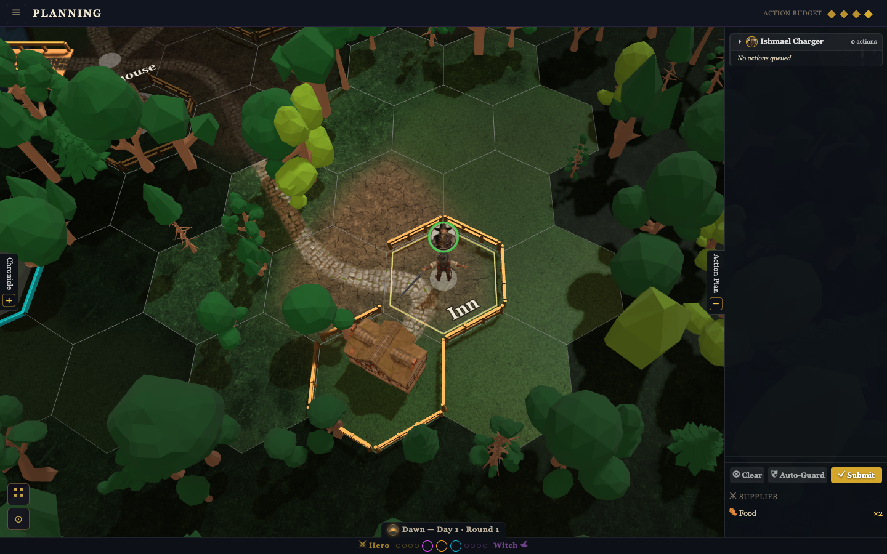

### 5.2 The Action Popup (radial arc menu)

A second tap on the selected unit opens a **radial arc** of action buttons (`ui-popup.js` positions
them; canvas connector lines tie them to the unit). Verbs map to `PlanActionType`: MOVE (via a hex
click — the default armed state after selecting), BATTLE_UNIT/BATTLE_HEX (via red target hexes),
EXPLORE, FORTIFY (hero, stackable), SUMMON (witch, stackable, per-type), HEAL, USE_ITEM/EQUIP_WEAPON
(free, once/round), USE_ABILITY, GUARD (stackable), SOUND_HORN (hero), SENT_TO (survivor → another
leader). Stackable actions keep the arc open and pulse; others auto-hide after a brief pulse.

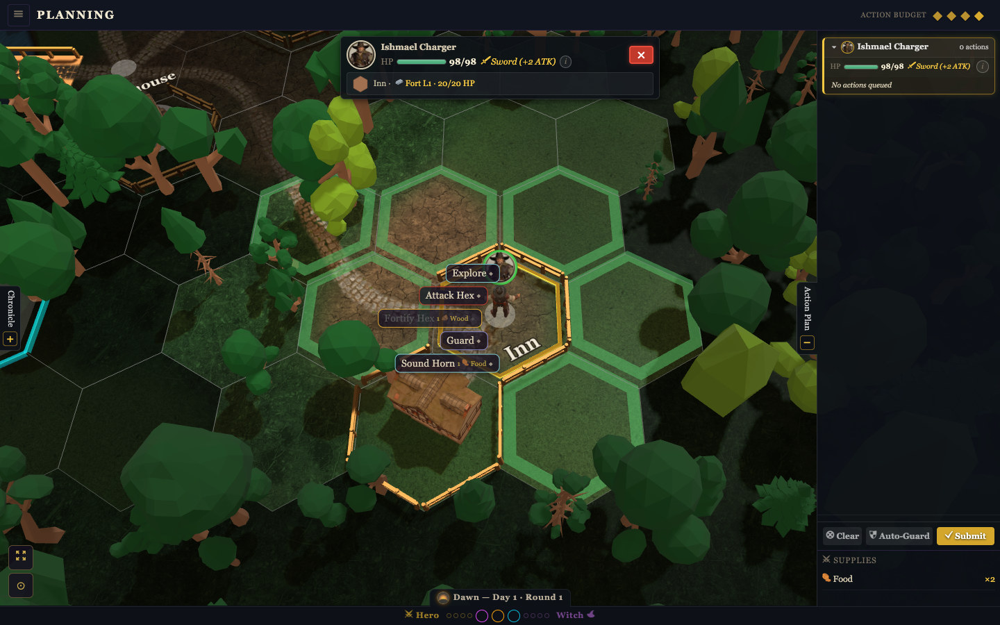

### 5.3 The ghost overlay & multi-move chaining

Every plan edit recomputes the ghost: `interleavePlan(unitPlans)` → `computeGhostState(state, flatPlan)`,
each step annotated `overBudget` if its running non-free cost exceeds the budget, written to
`renderer.planGhostSteps`. `_getProjectedPos(id)` returns a unit's tile *after* its queued plan and is
used everywhere (hit-testing, popup anchor, default-move origin) so you can **chain
MOVE → MOVE → action** by clicking projected tiles. The renderer draws dashed **numbered** move arrows,
red battle arrows (with an ×N target count), and translucent **walking ghost clones** that loop the
planned path.

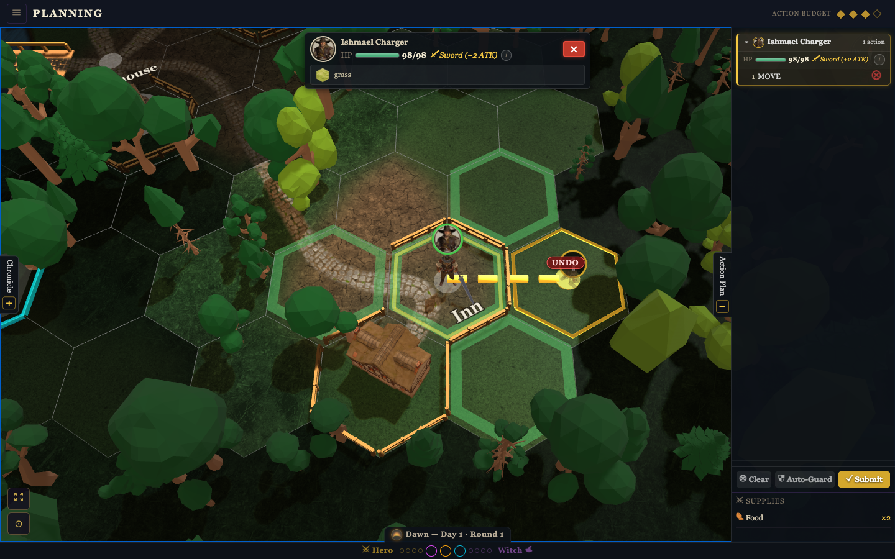

### 5.4 The Cancel Bar & targeting

Arming a targeted action sets `_awaitingTarget = {actionType, actor, hexTargets?}`, lights the valid
target hexes, and shows the floating **Cancel Bar** with a target hint. The Cancel button (or
re-selecting the actor) restores the default-move state.

### 5.5 The Plan Panel & submitting

The Plan Panel (pulled out via `#plan-tab`) lists per-unit action blocks with cost badges, the food
row, the player ready-list, and the inventory.

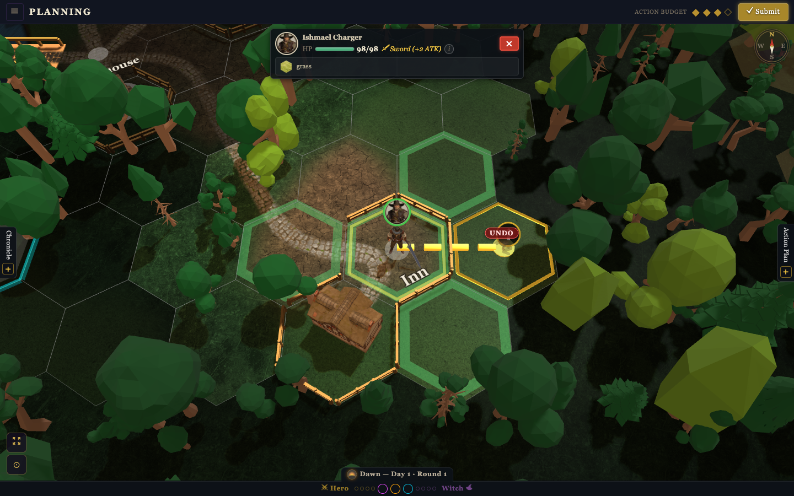

`#plan-submit-btn` (or `Shift+Enter`) calls `_doSubmitPlan`: `interleavePlan(unitPlans)` →
`markPlanSubmitted()` (paints the read-only "waiting" state, clears selection) → the `onPlanSubmit(plan)`
callback wired by `main.js` per mode (local resolution / `mp.submitPlan` / `mp.submitAsyncPlan`). The
plan is stored per-unit in `_unitPlans: Map<entityId, PlanAction[]>`.

---

## 6. Camera & input

### 6.1 The 3D camera

An `ArcRotateCamera` with an isometric board-game feel: starts north-up (`alpha = π/2`), isometric
tilt, radius 20, framing the full map. **Tilt is not a single locked angle** — beta ramps with zoom
(~30° near, eased toward ~5° at maximum zoom-out); **yaw is unbounded**; zoom radius `[5.5, 32]`. Babylon's
own `attachControl` is *not* used — a custom capture-phase pointer/wheel handler implements: 1-pointer
pan (world-grab — terrain stays under the cursor) or rotate (`cameraDragMode`; right-mouse always
rotates); 2-pointer pinch-zoom / twist-rotate; wheel/trackpad-pinch zoom. After the player deliberately
zooms, selection focus becomes **pan-only** (it preserves their distance). `viewLocked` /
`suppressAutoFrame` (replay FIXED camera) disable input and auto-framing.

### 6.2 Keyboard (`keybindings.js`)

`` ` `` console · `Esc` deselect · `H` (hold) shortcuts overlay · Arrows pan · `Shift+←/→` rotate ·
`Shift+↑/↓` zoom · `Tab`/`Shift+Tab` next/prev unit (or scrub replay cards) · `F` focus selection
(`#zoom-me`) · `M` fit map (`#zoom-fit`) · `X` clear the selected unit's actions · `Space`/`Enter`
advance (combat Continue → summary Continue → replay NEXT, most-specific first) · `P` replay play/pause ·
`Shift+Enter` submit plan. `Ctrl`/`Cmd`/`Alt` are never intercepted. Console commands:
`/inspector /forest /fog /fps /freecam /aiassist /seed /lunge /help`.

---

## 7. The 3D renderer interface

`Renderer3D(canvas, state)` (Babylon lazy-loaded on first `draw()`) is render-only; everything it shows
is pushed in via written slots (`planGhostSteps`, `_selection`, `_hover`, `unitInfoCards`,
`zoomLevel`, `cameraDragMode`, fog tints, …) and a large method surface (camera, animation, combat
cues, speech bubbles). An interface test pins that every 2D renderer method and every `renderer.<x>(`
call-site exists on the 3D renderer.

**What it renders:** pointy-top hex prisms with textured tops, MST road/river ribbon networks +
bridges, GLB-upgraded buildings & forests, fortification walls per `fortifyLevel`, entity **standees**
(billboarded portraits on owner-colour bases, upgraded to rigged GLB mannequin/paladin models with
bone-attached weapons/horses and an X-ray occlusion outline), always-on HP bars in a floating unit-icon
badge (which also shows planned odds/attack counts), selection glow + hover highlight, Power-Node
identifier rings, and time-of-day lighting (dawn gold / day neutral / dusk warm-red / night blue-violet)
cross-faded over phase transitions. Floating combat text, dice readout cards, speech bubbles, and arcing
projectiles complete the presentation.

**Fog of war (client display)** — active when `state.fogOfWar !== 'none'`. The observer is the player's
faction (online) or the non-AI side (offline); **both-AI ⇒ no observer ⇒ veil suppressed** (autoplay /
spectator see everything). The visible set is `computeLineOfSight` (the *same* LOS the rules/AI use —
buildings + forest occlude) with a per-phase sight range (day-faction Day 6 / Dawn-Dusk 4 / Night 3,
+1 with `scout`). Fogged tiles are darkened, fogged standees disabled — but a unit mid-move stays
visible until its animation ends.

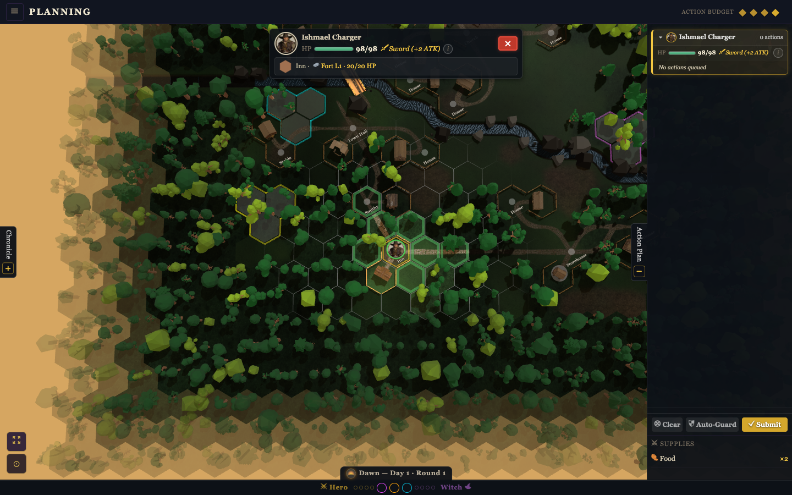

---

## 8. Resolution & replay presentation

### 8.1 The Sim/Show split (the invariant)

Resolution is a sealed `(state, plans) → steps[]` produced by the authority. The client only **plays
back** `steps[]`; it never authors state during replay. Pause / skip / speed / who-dismisses-first are
**presentation-only** and can never change the outcome.

### 8.2 Resolution animation (RESOLVING)

`_animateResolutionSteps(steps, finalEntities, redraw, humanFaction, myPlayerId)`:

1. Build a **step digest** (`buildStepDigest`, fog-gated by viewer faction) and compact runs of
   uneventful TURNs into a single column; show the **Replay Timeline** (`#replay-timeline`, one card per
   TURN) and set `AppMode = RESOLVING`.
2. Raise the inline **Replay HUD** transport (Back / ↺ / Next / AutoPlay / Stop / Camera-Follow), plus
   the **Replay Progress** dots for end-of-round review. `playback.paused = !replayAutoPlay`.
3. Per step: highlight the timeline card, animate moves (interpolated per-hop), play battles through the
   combat cinematic, and collect encounters/discoveries into dialogs shown after the step's motion.
   **Manual** mode holds on each card until NEXT/skip; **auto** mode uses timed holds.
4. After the loop: `AppMode = SUMMARY` and the end-of-round review (the wrap-up card; on game-over, the
   Victory/Defeat modal).

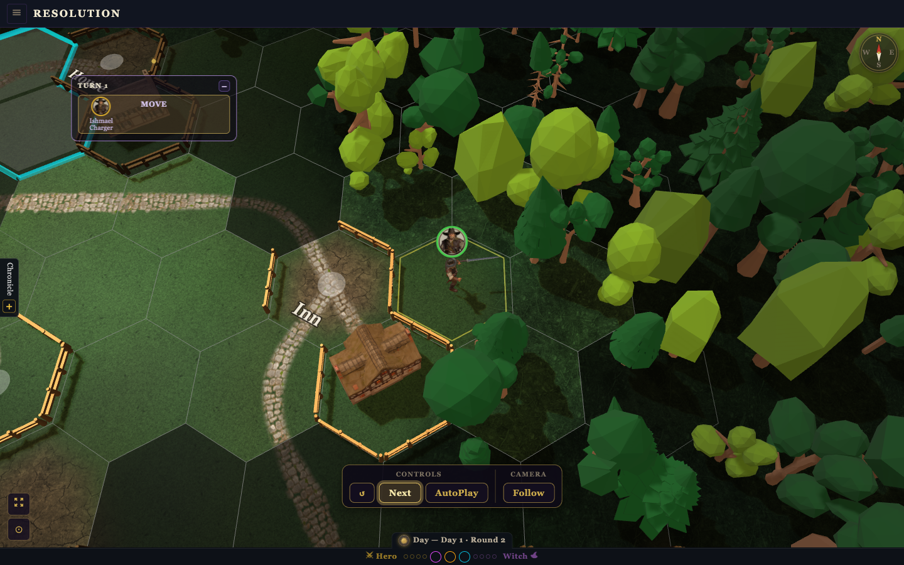

`speedMode ∈ {cinematic (default), fast, vfast}` (spectator & full-replay force `fast`); `vfast`
suppresses dialogs and uses ~140 ms holds, `cinematic` shows the full Battle Dialog for critical battles.

### 8.3 The combat cinematic (critical battles)

`run3DCombatCardHold`: position combatants (defender holds its slot; up to `ADVANTAGE_CAP` allies
half-lunge to the shared edge; the attacker's lunge is already underway) → freeze the strike at impact →
spawn big-number attacker/defender **dice readouts** + per-ally die-face readouts → reveal a **Continue**
button (3 s auto-click countdown, paused on hover) → resume the punch, play the hit/block reaction, and
run HP floaters / death burst / splash.

> The combat cinematic is rendered **in-canvas** (framed on the combatants), not as a DOM modal — the
> `#battle-dialog` element in the surface catalog (§4.3) is the 2D-renderer fallback. As a short,
> auto-advancing in-canvas effect it is best seen live; the dice readouts and the Continue gate appear
> above the combatants during a critical battle within the resolution view shown above.

### 8.4 The Round Summary

The wrap-up card recaps the round's events and offers **Replay** (re-watch) and **Next Turn** plus a
speed row. On game-over it becomes the (non-campaign) Game Over screen — Victory/Defeat with Return,
Replay, and **Replay Full Game**; campaign missions use the dedicated Debrief overlay instead.

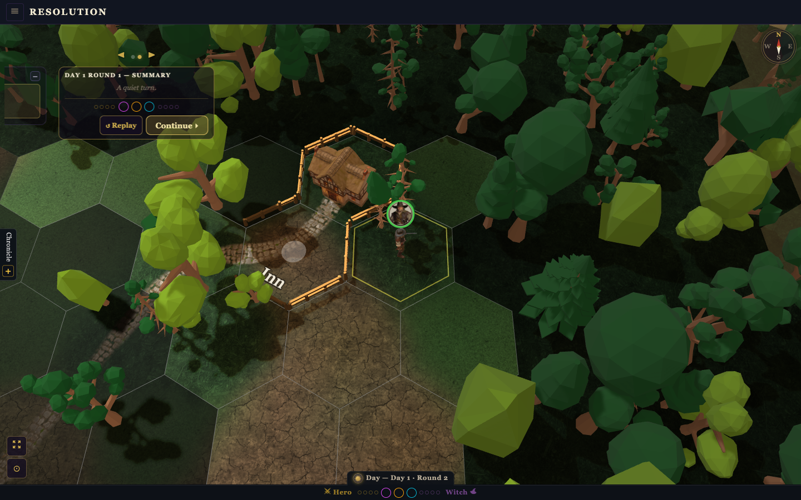

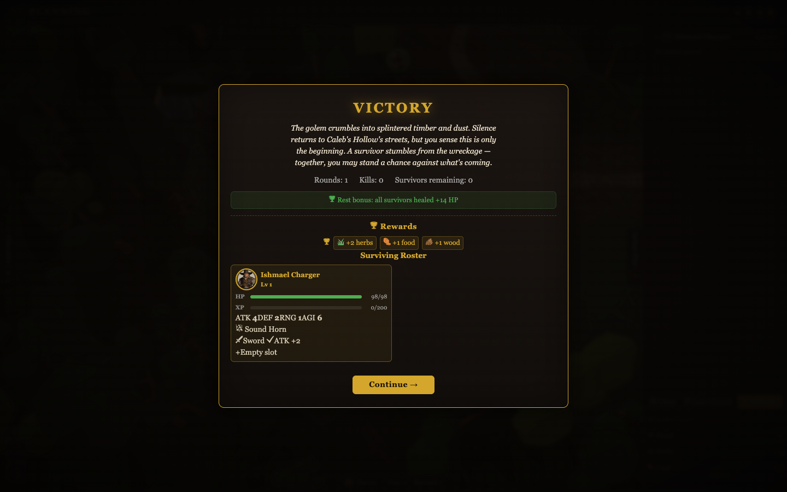

### 8.5 Full-game PLAYBACK

`replayFullGame` sets `AppMode = PLAYBACK`, forces `speedMode = fast`, and raises the full replay HUD.
It loops over rounds: deserialize each round's pre-state (fog off — full information), hold at
round-start until NEXT/PLAY, then animate that round's steps. Stop → exit dialog → MENU. Reached from the
game-over "Replay Full Game" button or the Ledger **Replays** list.

### 8.6 Conversations

`playConversation` is pure client presentation (no resolver / state-sync) in two contexts:

- **Round-boundary / turn-0** (`manageHud=true`) — runs pre-planning, raises its own inline replay HUD
  and timeline, exits planning, and sets `AppMode = RESOLVING` before the first bubble. The card ends on
  an explicit **CONTINUE**, then opens planning.
- **Area / mid-replay** (`manageHud=false`) — interleaved between resolution steps as a
  `kind:'conversation'` timeline card; NEXT advances dialog lines while the step loop blocks.

Per line it orients the speaker toward the group, frames the live speaker with bubble headroom (or shows
an off-screen arrow under a FIXED camera), renders a persistent speech bubble, and plays a voice clip if
one exists. Auto-advance waits `max(reading-time, clip-end)` (capped at 30 s). The 2D/headless fallback
is a blocking Story Modal per line.

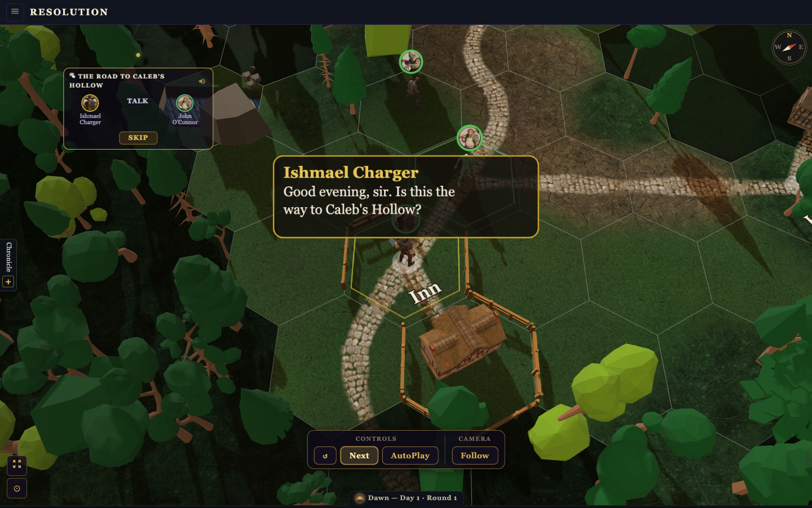

---

## 9. Spectator & async

**Spectator** is a separate page flow (`?spectate=<room>` / `?room=`): a `UIMode.SPECTATOR` UIController
drives `#spectator-banner` ("● SPECTATING"), an info bar (hero / round / witch), a per-player ready
panel, and a game-over readout. Fog is off (full board). `AppMode` stays MENU.

**Async / correspondence** games connect via `connectAsync` / `submitAsyncPlan`; an open async game
enters PLANNING through `_handleAsyncStateUpdate`, and resolved async rounds are replayed like any other.

---

## 10. Notes & discrepancies for reimplementers

1. **`AppMode.SUBMITTED`** is reconnect-only in practice; the "waiting" state is the UI flag
   `ui._planSubmitted` while `AppMode` stays PLANNING.
2. **`AppMode.SPECTATING`** is never set via `setMode`; spectating is a separate page flow using
   `UIMode.SPECTATOR`.
3. **3D is the only runtime renderer** — there is no 2D toggle in the Ledger; `renderer.js` (Canvas 2D)
   is editor/admin-only.
4. **Camera tilt is not locked at 45°** — beta ramps ~30°→5° with zoom; yaw is unbounded.
5. **The legacy `#setup-screen` step machine is dead** — Mode/New-Game/Options/Waiting "cards" are now
   Ledger panels.
6. **Phase / Score toasts are retired**; the full-screen Chronicle overlay is dormant (the live log is
   the `#chronicle-sidebar`).
7. **Round Summary doubles as the non-campaign Game Over screen**; campaign uses `#debrief-overlay`.
8. **`speedMode` values are `cinematic` / `fast` / `vfast`** (not "normal"). The replay HUD "Detail"
   (Full/Summary/Speedy) control is currently hidden.
9. **`AppMode.RESOLVING` is broader than "live current round"** — it also covers re-watch, pre-planning
   conversations, and async/cached replays. `PLAYBACK` is strictly the full-game replay.

---

*End of Client Behavior Specification. See `01-game-design-spec.md` for the rules/server and
`02-ai-system-spec.md` for the AI.*
